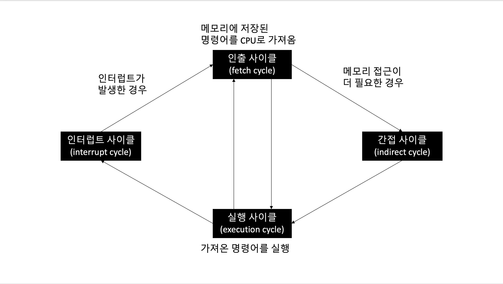
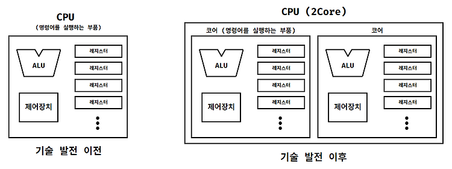
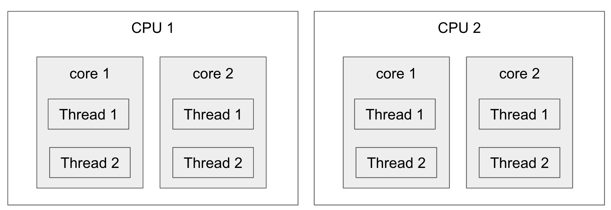
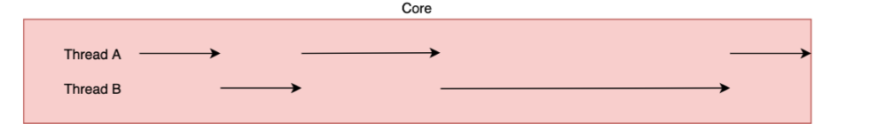
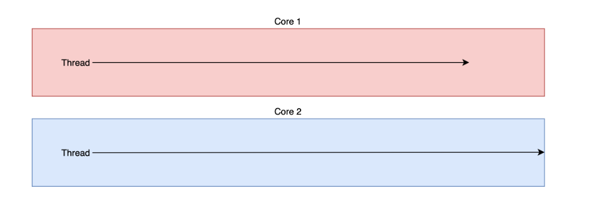
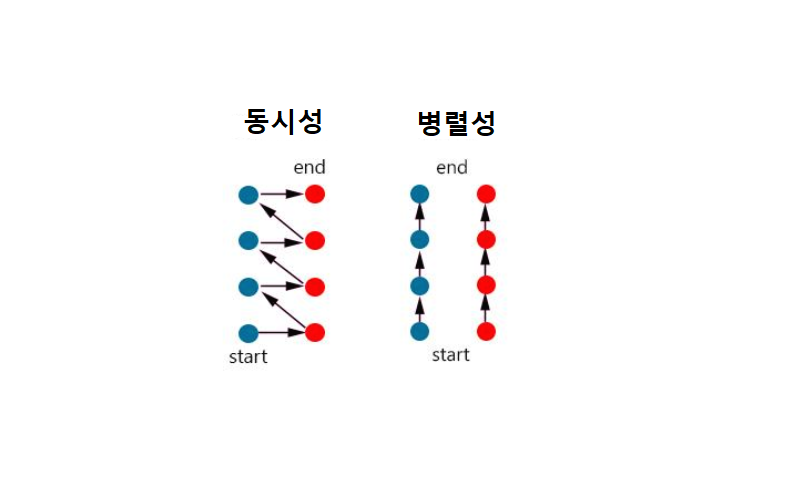
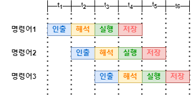

# CPU

---

## 1. CPU란?

**CPU(Central Processing Unit)** 는 컴퓨터에서 명령어를 읽고, 해석하고, 실행하는 핵심 부품이다.

컴퓨터가 이해하는 정보는 크게 **데이터**와 **명령어**로 나뉜다.  
CPU는 메모리에 저장된 명령어를 가져와 해석하고, 필요한 데이터를 이용해 연산을 수행한 뒤 결과를 저장한다.

```text
메모리
  ↓ 명령어와 데이터 전달
CPU
  ↓ 명령어 해석 및 실행
결과 저장 또는 출력
```

CPU는 흔히 사람의 두뇌에 비유된다.  
다만 CPU는 스스로 모든 정보를 저장하는 장치라기보다는, 메모리에 저장된 명령어를 빠르게 처리하는 실행 장치에 가깝다.

CPU의 주요 구성 요소는 다음과 같다.

| 구성 요소 | 설명 |
|----------|------|
| ALU | 산술 연산과 논리 연산을 수행 |
| 제어장치 | 명령어를 해석하고 제어 신호를 발생 |
| 레지스터 | CPU 내부의 작은 임시 저장장치 |

---

# 2. 레지스터

---

## 2.1 레지스터란?

**레지스터(Register)** 는 CPU 내부에 존재하는 작은 임시 저장장치이다.

CPU는 명령어를 실행하는 과정에서 여러 데이터를 잠시 저장해야 한다.  
이때 메모리에 매번 접근하면 속도가 느리기 때문에, CPU 내부의 매우 빠른 저장장치인 레지스터를 사용한다.

레지스터에는 다음과 같은 정보가 저장될 수 있다.

```text
현재 실행 중인 명령어
다음에 실행할 명령어의 주소
연산에 사용할 데이터
연산 결과
메모리 주소
CPU 상태 정보
```

CPU 내부에는 다양한 레지스터가 존재하며, 각 레지스터는 서로 다른 이름과 역할을 가진다.

---

## 2.2 대표적인 레지스터

대표적인 레지스터는 다음과 같다.

| 레지스터 | 역할 |
|----------|------|
| 프로그램 카운터 | 다음에 실행할 명령어의 주소 저장 |
| 명령어 레지스터 | 현재 해석 중인 명령어 저장 |
| 범용 레지스터 | 데이터, 주소, 중간 결과 등을 저장 |
| 플래그 레지스터 | 연산 결과와 CPU 상태 정보 저장 |
| 스택 포인터 | 스택 영역의 최상단 위치 저장 |

---

# 3. 프로그램 카운터

---

## 3.1 프로그램 카운터란?

**프로그램 카운터(Program Counter, PC)** 는 **메모리에서 다음으로 읽어 들일 명령어의 주소**를 저장하는 레지스터이다.

CPU는 프로그램 카운터에 저장된 주소를 보고, 메모리에서 다음 명령어를 가져온다.

```text
프로그램 카운터
      ↓
다음 명령어의 메모리 주소
      ↓
메모리에서 명령어 인출
```

프로그램이 순차적으로 실행될 수 있는 이유는 프로그램 카운터가 다음 명령어의 주소를 가리키기 때문이다.

---

## 3.2 프로그램 카운터의 기본 동작

예를 들어 메모리에 다음과 같이 명령어가 저장되어 있다고 하자.

```text
메모리 주소     명령어
100번지        LOAD R1, 10
101번지        LOAD R2, 20
102번지        ADD R1, R2
103번지        STORE R1, 200
```

프로그램 카운터가 `100번지`를 가리키고 있다면 CPU는 100번지의 명령어를 읽어 들인다.

```text
PC = 100
  ↓
메모리 100번지 명령어 인출
  ↓
LOAD R1, 10 실행
  ↓
PC = 101
```

그 다음 프로그램 카운터는 다음 명령어 주소로 증가한다.

```text
PC = 101
  ↓
메모리 101번지 명령어 인출
  ↓
LOAD R2, 20 실행
  ↓
PC = 102
```

이 과정을 반복하면서 프로그램은 순차적으로 실행된다.

> 교재에서는 프로그램 카운터가 일반적으로 1씩 증가한다고 설명하는 경우가 많다.  
> 실제 CPU에서는 명령어의 크기와 주소 단위에 따라 증가량이 달라질 수 있지만, 핵심은 **다음 명령어의 주소로 갱신된다**는 점이다.

---

## 3.3 CPU와 메모리 사이에서 프로그램 카운터의 동작

프로그램 카운터의 동작은 다음과 같이 이해할 수 있다.

```text
[1] 프로그램 카운터가 다음 명령어 주소를 저장
        ↓
[2] CPU가 해당 주소를 메모리에 전달
        ↓
[3] 메모리가 해당 주소의 명령어를 CPU로 전달
        ↓
[4] 명령어 레지스터에 명령어 저장
        ↓
[5] 프로그램 카운터가 다음 명령어 주소로 갱신
```

그림으로 표현하면 다음과 같다.

```text
CPU 내부
┌──────────────────────────────┐
│ Program Counter              │
│ PC = 100                     │
└───────────────┬──────────────┘
                │ 100번지 명령어 요청
                ▼

메모리
┌───────────────┬────────────────┐
│ 주소          │ 명령어          │
├───────────────┼────────────────┤
│ 100           │ LOAD R1, 10     │
│ 101           │ LOAD R2, 20     │
│ 102           │ ADD R1, R2      │
│ 103           │ STORE R1, 200   │
└───────────────┴────────────────┘
                │
                ▼

CPU 내부
┌──────────────────────────────┐
│ Instruction Register          │
│ LOAD R1, 10                   │
└──────────────────────────────┘
```

---

## 3.4 프로그램 카운터가 순차적으로 증가하지 않는 경우

프로그램 카운터가 항상 다음 주소로만 증가하는 것은 아니다.

조건문, 반복문, 함수 호출, return 문과 같은 경우에는 프로그램의 실행 흐름이 바뀐다.  
이때 프로그램 카운터 값은 특정 위치로 변경된다.

예를 들어 다음과 같은 Java 코드가 있다고 하자.

```java
if (score >= 60) {
    System.out.println("pass");
} else {
    System.out.println("fail");
}
```

이 코드는 조건에 따라 실행 위치가 달라진다.

```text
조건이 참이면 → pass 출력 부분으로 이동
조건이 거짓이면 → fail 출력 부분으로 이동
```

CPU 수준에서는 이러한 흐름 변화가 프로그램 카운터 값의 변경으로 표현된다.

```text
순차 실행:
PC = 100 → 101 → 102 → 103

분기 실행:
PC = 100 → 101 → 250
```

예시 그림은 다음과 같다.

```text
메모리 주소     명령어
100번지        CMP score, 60
101번지        JGE 200
102번지        PRINT "fail"
103번지        JMP 300
200번지        PRINT "pass"
300번지        END
```

조건이 참이면 프로그램 카운터는 `102번지`가 아니라 `200번지`로 변경된다.

```text
PC = 101
  ↓
조건이 참
  ↓
PC = 200
```

즉, 프로그램 카운터는 프로그램 실행 흐름을 결정하는 핵심 레지스터이다.

---

# 4. 명령어 레지스터

---

## 4.1 명령어 레지스터란?

**명령어 레지스터(Instruction Register, IR)** 는 메모리에서 방금 읽어 들인 명령어를 저장하는 레지스터이다.

CPU는 프로그램 카운터가 가리키는 주소에서 명령어를 가져온 뒤, 그 명령어를 명령어 레지스터에 저장한다.

```text
메모리에서 명령어 인출
        ↓
명령어 레지스터에 저장
        ↓
제어장치가 명령어 해석
```

예를 들어 메모리에서 다음 명령어를 가져왔다고 하자.

```text
ADD R1, R2
```

이 명령어는 명령어 레지스터에 저장되고, 제어장치가 이를 해석한다.

```text
Instruction Register = ADD R1, R2
```

명령어 레지스터는 CPU가 현재 어떤 명령어를 처리 중인지 나타내는 중요한 레지스터이다.

---

# 5. 범용 레지스터

---

## 5.1 범용 레지스터란?

**범용 레지스터(General Purpose Register)** 는 이름 그대로 다양한 목적으로 사용할 수 있는 일반적인 레지스터이다.

범용 레지스터에는 다음과 같은 값이 저장될 수 있다.

```text
연산에 사용할 데이터
연산 결과
메모리 주소
명령어 처리 중 필요한 중간값
```

예를 들어 다음과 같은 명령어가 있다고 하자.

```text
ADD R1, R2
```

이 명령어는 `R1`과 `R2`에 저장된 값을 더하는 명령어라고 볼 수 있다.

```text
R1 = 10
R2 = 20

ADD R1, R2 실행

R1 = 30
```

범용 레지스터는 CPU 내부에 여러 개 존재하며, 연산 처리 과정에서 매우 자주 사용된다.

---

# 6. 플래그 레지스터

---

## 6.1 플래그 레지스터란?

**플래그 레지스터(Flag Register)** 는 연산 결과 또는 CPU 상태에 대한 부가 정보를 저장하는 레지스터이다.

여기서 **플래그(Flag)** 란 CPU가 명령어를 처리하는 과정에서 참고해야 하는 상태 정보를 의미한다.  
플래그는 보통 하나의 비트로 표현된다.

예를 들어 어떤 연산 결과가 0인지, 음수인지, 자리올림이 발생했는지 등을 플래그로 저장할 수 있다.

```text
연산 수행
  ↓
결과 상태 확인
  ↓
플래그 레지스터 갱신
```

---

## 6.2 대표적인 플래그

| 플래그 | 설명 | 사용 예시 |
|--------|------|----------|
| 부호 플래그 | 연산 결과가 음수인지 여부를 나타낸다. | 뺄셈 결과가 음수인지 판단할 때 사용 |
| 제로 플래그 | 연산 결과가 0인지 여부를 나타낸다. | 두 값이 같은지 비교할 때 사용 |
| 캐리 플래그 | 연산 결과에서 자리올림 또는 빌림이 발생했는지 나타낸다. | 부호 없는 정수 연산에서 오버플로우 판단 |
| 오버플로우 플래그 | 부호 있는 정수 연산에서 표현 범위를 초과했는지 나타낸다. | `127 + 1`이 8비트 signed 범위를 초과하는 경우 |
| 인터럽트 플래그 | CPU가 인터럽트를 받아들일 수 있는지 여부를 나타낸다. | 인터럽트 허용 또는 차단 상태 판단 |
| 슈퍼바이저 플래그 | 현재 CPU가 커널 모드인지 사용자 모드인지 나타낸다. | 운영체제의 권한 제어에 사용 |

---

## 6.3 제로 플래그 예시

두 값을 비교하는 명령어가 있다고 하자.

```text
CMP R1, R2
```

만약 `R1`과 `R2`의 값이 같다면 비교 결과는 0이 된다.  
이때 제로 플래그가 활성화된다.

```text
R1 = 10
R2 = 10

CMP R1, R2
결과 = 0

Zero Flag = 1
```

이후 CPU는 제로 플래그를 보고 조건 분기를 수행할 수 있다.

```text
Zero Flag가 1이면 특정 주소로 이동
```

이런 방식으로 조건문과 반복문이 구현될 수 있다.

---

## 6.4 캐리 플래그와 오버플로우 플래그의 차이

캐리 플래그와 오버플로우 플래그는 모두 연산 결과가 표현 범위를 벗어나는 상황과 관련이 있다.  
그러나 사용되는 관점이 다르다.

| 구분 | 주 사용 대상 | 의미 |
|------|-------------|------|
| 캐리 플래그 | 부호 없는 정수 | 자리올림 또는 빌림 발생 |
| 오버플로우 플래그 | 부호 있는 정수 | 부호 있는 수의 표현 범위 초과 |

예를 들어 8비트 부호 있는 정수의 범위는 다음과 같다.

```text
-128 ~ 127
```

이때 다음 연산은 오버플로우를 발생시킨다.

```text
127 + 1 = 128
```

8비트 signed 정수는 128을 표현할 수 없으므로 오버플로우 플래그가 활성화될 수 있다.

---

# 7. 스택 포인터

---

## 7.1 스택 포인터란?

**스택 포인터(Stack Pointer, SP)** 는 메모리의 스택 영역에서 **스택의 최상단 위치**를 가리키는 레지스터이다.

프로그램이 실행될 때 메모리에는 스택처럼 사용되는 영역이 존재한다.  
이 영역을 **스택 영역(Stack Area)** 이라고 한다.

스택 영역은 다음과 같은 데이터를 저장하는 데 사용된다.

```text
함수 호출 정보
지역 변수
매개변수
복귀 주소
임시 데이터
인터럽트 발생 시 백업 정보
```

스택은 후입선출 구조이다.

```text
Last In, First Out
LIFO
```

즉, 가장 나중에 들어간 데이터가 가장 먼저 나온다.

---

## 7.2 CPU와 메모리에서 스택 포인터의 동작

스택 포인터는 현재 스택의 최상단 위치를 가리킨다.

예를 들어 메모리의 일부가 스택 영역으로 사용된다고 하자.

```text
메모리의 스택 영역

높은 주소
┌───────────────┐
│               │
├───────────────┤
│ 이전 데이터    │
├───────────────┤
│ 현재 최상단    │ ← SP
├───────────────┤
│               │
└───────────────┘
낮은 주소
```

스택에 데이터를 넣는 작업을 `push`라고 하고, 꺼내는 작업을 `pop`이라고 한다.

---

## 7.3 Push 동작

스택에 데이터를 추가하면 스택 포인터가 새로운 최상단 위치를 가리킨다.

```text
push 10 실행 전

┌───────────────┐
│               │
├───────────────┤
│ 20            │ ← SP
├───────────────┤
│ 30            │
└───────────────┘
```

```text
push 10 실행 후

┌───────────────┐
│ 10            │ ← SP
├───────────────┤
│ 20            │
├───────────────┤
│ 30            │
└───────────────┘
```

---

## 7.4 Pop 동작

스택에서 데이터를 꺼내면 스택 포인터는 이전 위치로 이동한다.

```text
pop 실행 전

┌───────────────┐
│ 10            │ ← SP
├───────────────┤
│ 20            │
├───────────────┤
│ 30            │
└───────────────┘
```

```text
pop 실행 후

┌───────────────┐
│               │
├───────────────┤
│ 20            │ ← SP
├───────────────┤
│ 30            │
└───────────────┘
```

스택 포인터는 함수 호출, 복귀, 인터럽트 처리에서 매우 중요한 역할을 한다.

---

# 8. 인터럽트

---

## 8.1 인터럽트란?

**인터럽트(Interrupt)** 는 CPU가 수행 중인 작업을 잠시 중단시키는 신호이다.

인터럽트라는 단어는 “방해하다”, “중단시키다”라는 의미를 가진다.

CPU는 명령어를 순차적으로 실행하지만, 실행 도중 긴급하게 처리해야 할 사건이 발생할 수 있다.  
이때 CPU에게 현재 작업을 잠시 멈추고 다른 작업을 처리하도록 알리는 신호가 인터럽트이다.

```text
기존 작업 실행 중
        ↓
인터럽트 발생
        ↓
기존 작업 잠시 중단
        ↓
인터럽트 처리
        ↓
기존 작업 재개
```

---

## 8.2 인터럽트의 종류

인터럽트는 크게 두 가지로 나눌 수 있다.

| 구분 | 설명 | 예시 |
|------|------|------|
| 동기 인터럽트 | CPU가 명령어를 실행하는 과정에서 발생 | 0으로 나누기, 잘못된 메모리 접근, 페이지 폴트 |
| 비동기 인터럽트 | CPU 외부 장치에 의해 발생 | 키보드 입력, 디스크 작업 완료, 네트워크 패킷 도착 |

---

## 8.3 동기 인터럽트

**동기 인터럽트(Synchronous Interrupt)** 는 CPU가 명령어를 실행하는 과정에서 발생하는 인터럽트이다.

일반적으로 프로그래밍 오류나 예외적인 상황을 만났을 때 발생한다.  
그래서 동기 인터럽트는 보통 **예외(Exception)** 라고 부른다.

예시는 다음과 같다.

```text
0으로 나누기
잘못된 메모리 주소 접근
권한 없는 명령어 실행
페이지 폴트
```

동기 인터럽트는 특정 명령어를 실행하다가 발생하므로, 어떤 명령어 때문에 발생했는지 비교적 명확하다.

---

## 8.4 비동기 인터럽트

**비동기 인터럽트(Asynchronous Interrupt)** 는 CPU가 실행 중인 명령어와 직접적인 관련 없이 외부 장치에 의해 발생하는 인터럽트이다.

주로 입출력장치가 CPU에게 작업 완료나 입력 발생을 알릴 때 사용한다.

예시는 다음과 같다.

```text
키보드 입력 발생
마우스 클릭 발생
디스크 읽기 완료
프린터 출력 완료
네트워크 데이터 도착
타이머 만료
```

비동기 인터럽트는 하드웨어 장치가 발생시키는 경우가 많기 때문에 **하드웨어 인터럽트**라고도 한다.

---

# 9. 하드웨어 인터럽트

---

## 9.1 하드웨어 인터럽트를 사용하는 이유

CPU는 매우 빠르게 동작하지만, 입출력장치는 CPU에 비해 상대적으로 느리다.

예를 들어 CPU가 디스크에 데이터를 요청했다고 하자.  
디스크 작업이 완료될 때까지 CPU가 계속 기다린다면 CPU 자원이 낭비된다.

비효율적인 방식은 다음과 같다.

```text
CPU: 디스크 작업 끝났나요?
디스크: 아직입니다.

CPU: 디스크 작업 끝났나요?
디스크: 아직입니다.

CPU: 디스크 작업 끝났나요?
디스크: 끝났습니다.
```

이처럼 CPU가 계속 확인하는 방식을 **폴링(Polling)** 이라고 한다.

폴링은 단순하지만 CPU가 불필요하게 반복 확인을 해야 한다는 단점이 있다.

반면 하드웨어 인터럽트를 사용하면 입출력장치가 작업을 완료했을 때 CPU에게 알려준다.

```text
CPU: 디스크에게 작업 요청
CPU: 다른 작업 수행
디스크: 작업 완료
디스크 → CPU: 인터럽트 요청
CPU: 디스크 작업 결과 처리
```

따라서 하드웨어 인터럽트는 CPU가 입출력 작업을 효율적으로 처리할 수 있도록 도와준다.

---

## 9.2 하드웨어 인터럽트 처리 순서

CPU가 하드웨어 인터럽트를 처리하는 과정은 다음과 같다.

```text
1. 입출력장치가 CPU에게 인터럽트 요청 신호를 보낸다.
2. CPU는 실행 사이클이 끝나고 다음 명령어를 인출하기 전에 인터럽트 여부를 확인한다.
3. CPU는 인터럽트 플래그를 확인하여 현재 인터럽트를 받아들일 수 있는지 판단한다.
4. 인터럽트를 받아들일 수 있다면 현재 작업 상태를 백업한다.
5. CPU는 인터럽트 벡터를 참조하여 인터럽트 서비스 루틴을 실행한다.
6. 인터럽트 서비스 루틴 실행이 끝나면 백업해 둔 작업 상태를 복구한다.
7. CPU는 기존 작업을 이어서 실행한다.
```

그림으로 표현하면 다음과 같다.

```text
프로그램 실행
    ↓
입출력장치에서 인터럽트 요청
    ↓
CPU가 인터럽트 수용 여부 확인
    ↓
현재 프로그램 상태 백업
    ↓
인터럽트 벡터 참조
    ↓
인터럽트 서비스 루틴 실행
    ↓
백업한 상태 복구
    ↓
기존 프로그램 실행 재개
```

---

## 9.3 인터럽트 요청 신호

**인터럽트 요청 신호(Interrupt Request)** 는 입출력장치가 CPU에게 인터럽트를 처리해 달라고 요청하는 신호이다.

인터럽트는 CPU의 정상적인 실행 흐름을 끊는 작업이다.  
따라서 외부 장치가 임의로 CPU의 흐름을 바꾸는 것이 아니라, 먼저 CPU에게 인터럽트 요청 신호를 보낸다.

```text
입출력장치
   ↓ 인터럽트 요청 신호
CPU
```

---

## 9.4 인터럽트 플래그

**인터럽트 플래그(Interrupt Flag)** 는 CPU가 현재 인터럽트를 받아들일 수 있는지 여부를 나타내는 플래그이다.

인터럽트 플래그가 활성화되어 있으면 CPU는 인터럽트 요청을 받아들일 수 있다.  
반대로 인터럽트 플래그가 비활성화되어 있으면 CPU는 일반적인 인터럽트 요청을 무시할 수 있다.

```text
Interrupt Flag = 1 → 인터럽트 허용
Interrupt Flag = 0 → 인터럽트 차단
```

다만 모든 인터럽트를 막을 수 있는 것은 아니다.

하드웨어 인터럽트는 다음과 같이 나눌 수 있다.

| 구분 | 설명 |
|------|------|
| Maskable Interrupt | 인터럽트 플래그로 막을 수 있는 인터럽트 |
| Non-Maskable Interrupt | 인터럽트 플래그로 막을 수 없는 인터럽트 |

막을 수 없는 인터럽트는 보통 시스템에 매우 중요한 문제가 발생했을 때 사용된다.

예시:

```text
하드웨어 오류
전원 이상
메모리 오류
치명적인 시스템 이벤트
```

---

## 9.5 인터럽트 서비스 루틴

**인터럽트 서비스 루틴(Interrupt Service Routine, ISR)** 은 인터럽트를 처리하기 위한 프로그램이다.

인터럽트 서비스 루틴은 **인터럽트 핸들러(Interrupt Handler)** 라고도 부른다.

인터럽트 서비스 루틴에는 다음과 같은 내용이 포함된다.

```text
어떤 인터럽트인지 확인
필요한 데이터 읽기
장치 상태 처리
운영체제에 알림
기존 실행 흐름으로 복귀
```

예를 들어 키보드 입력 인터럽트가 발생하면, 키보드 인터럽트 서비스 루틴은 입력된 키 값을 읽고 운영체제에 전달한다.

---

## 9.6 인터럽트 벡터

**인터럽트 벡터(Interrupt Vector)** 는 인터럽트 서비스 루틴의 시작 주소를 저장하는 정보이다.

인터럽트 종류마다 처리해야 할 방식이 다르다.  
따라서 CPU는 어떤 인터럽트가 발생했는지 확인한 뒤, 해당 인터럽트를 처리할 서비스 루틴을 찾아야 한다.

이때 사용하는 것이 인터럽트 벡터이다.

```text
인터럽트 발생
   ↓
인터럽트 번호 확인
   ↓
인터럽트 벡터 참조
   ↓
해당 인터럽트 서비스 루틴 주소 확인
   ↓
인터럽트 서비스 루틴 실행
```

예시는 다음과 같다.

| 인터럽트 번호 | 인터럽트 종류 | 서비스 루틴 주소 |
|--------------|--------------|----------------|
| 0 | 타이머 인터럽트 | 1000번지 |
| 1 | 키보드 인터럽트 | 1200번지 |
| 2 | 디스크 인터럽트 | 1500번지 |
| 3 | 네트워크 인터럽트 | 1800번지 |

---

## 9.7 인터럽트 처리 중 상태 백업

인터럽트가 발생하면 CPU는 기존 프로그램 실행을 잠시 멈추고 인터럽트 서비스 루틴을 실행해야 한다.

그런데 인터럽트 처리가 끝난 뒤에는 원래 실행하던 프로그램으로 돌아와야 한다.  
이를 위해 CPU는 기존 작업 상태를 백업한다.

백업해야 할 정보에는 다음과 같은 것이 포함될 수 있다.

```text
프로그램 카운터 값
일부 레지스터 값
플래그 레지스터 값
실행 중인 프로그램의 상태
```

이 정보들은 보통 메모리의 스택 영역에 저장된다.

```text
기존 프로그램 실행 중
        ↓
인터럽트 발생
        ↓
PC, 레지스터, 플래그 등 상태를 스택에 저장
        ↓
인터럽트 서비스 루틴 실행
        ↓
스택에서 상태 복구
        ↓
기존 프로그램 재개
```

---

## 9.8 명령어 사이클과 인터럽트

CPU는 일반적으로 하나의 명령어 실행이 끝난 뒤, 다음 명령어를 인출하기 전에 인터럽트 발생 여부를 확인한다.

```text
명령어 인출
    ↓
명령어 실행
    ↓
인터럽트 확인
    ↓
다음 명령어 인출
```

정리하면 명령어 사이클은 다음과 같은 흐름을 가진다.

```text
인출 사이클
    ↓
실행 사이클
    ↓
인터럽트 확인
    ↓
인터럽트가 있으면 인터럽트 사이클
    ↓
다음 명령어 처리
```



---

# 10. 예외

---

## 10.1 예외란?

**예외(Exception)** 는 CPU가 명령어를 실행하는 과정에서 발생하는 동기 인터럽트이다.

예외는 CPU 외부 장치가 발생시키는 하드웨어 인터럽트와 달리, 현재 실행 중인 명령어와 직접적으로 관련이 있다.

예시는 다음과 같다.

```text
0으로 나누기
잘못된 메모리 접근
페이지 폴트
권한 없는 명령어 실행
디버깅 중 브레이크 포인트 도달
```

---

## 10.2 예외의 종류

예외는 대표적으로 다음과 같이 나눌 수 있다.

| 예외 종류 | 설명 | 실행 재개 위치 |
|----------|------|---------------|
| 폴트 | 예외 처리 후 예외가 발생한 명령어부터 다시 실행 | 예외 발생 명령어 |
| 트랩 | 예외 처리 후 예외가 발생한 다음 명령어부터 실행 | 다음 명령어 |
| 중단 | 심각한 오류로 인해 프로그램 실행을 강제로 중단 | 재개하지 않음 |
| 소프트웨어 인터럽트 | 프로그램이 의도적으로 발생시키는 인터럽트 | 상황에 따라 다름 |

---

## 10.3 폴트

**폴트(Fault)** 는 예외를 처리한 직후 **예외가 발생한 명령어부터 실행을 재개하는 예외**이다.

대표적인 예시는 **페이지 폴트(Page Fault)** 이다.

CPU가 어떤 명령어를 실행하려고 할 때 필요한 데이터가 메모리에 없고, 보조기억장치에 있다고 하자.

```text
CPU가 데이터 접근 시도
        ↓
데이터가 메모리에 없음
        ↓
페이지 폴트 발생
        ↓
운영체제가 보조기억장치에서 데이터를 메모리로 가져옴
        ↓
예외가 발생한 명령어부터 다시 실행
```

이 경우 CPU는 해당 데이터를 메모리에 적재한 뒤, 원래 실행하려던 명령어를 다시 실행해야 한다.  
따라서 폴트는 예외가 발생한 명령어부터 재개된다.

---

## 10.4 트랩

**트랩(Trap)** 은 예외를 처리한 직후 **예외가 발생한 명령어의 다음 명령어부터 실행을 재개하는 예외**이다.

대표적인 사례는 디버깅에서 사용하는 **브레이크 포인트(Breakpoint)** 이다.

```text
명령어 실행
        ↓
브레이크 포인트 도달
        ↓
트랩 발생
        ↓
디버거가 상태 확인
        ↓
다음 명령어부터 실행 재개
```

트랩은 시스템 호출(System Call)과도 관련이 있다.  
사용자 프로그램이 운영체제의 기능을 사용하기 위해 의도적으로 예외를 발생시키는 방식으로 구현될 수 있다.

---

## 10.5 중단

**중단(Abort)** 은 CPU가 실행 중인 프로그램을 계속 실행할 수 없을 정도의 심각한 오류를 발견했을 때 발생하는 예외이다.

예시는 다음과 같다.

```text
치명적인 하드웨어 오류
심각한 메모리 손상
복구 불가능한 시스템 오류
```

중단은 일반적으로 기존 명령어로 돌아가 실행을 재개하지 않는다.

---

## 10.6 소프트웨어 인터럽트

**소프트웨어 인터럽트(Software Interrupt)** 는 프로그램이 의도적으로 발생시키는 인터럽트이다.

운영체제 기능을 요청하는 시스템 호출이 대표적인 예시이다.

예를 들어 사용자 프로그램이 파일을 읽거나 네트워크 통신을 하려면 운영체제의 도움을 받아야 한다.  
이때 소프트웨어 인터럽트나 유사한 메커니즘을 통해 커널에 작업을 요청한다.

```text
사용자 프로그램
    ↓ 시스템 호출
운영체제 커널
    ↓
파일 읽기, 네트워크 통신, 프로세스 제어
```

---

# 11. CPU 성능 향상을 위한 설계

---

## 11.1 CPU 성능 향상의 주요 방향

CPU 성능을 향상시키기 위한 대표적인 방향은 다음과 같다.

| 방법 | 설명 |
|------|------|
| 클럭 속도 증가 | CPU가 더 빠른 주기로 동작하도록 함 |
| 멀티코어 | 여러 코어가 작업을 나누어 처리 |
| 멀티스레드 | 하나의 코어가 여러 실행 흐름을 처리 |
| 명령어 병렬 처리 | 여러 명령어를 겹쳐 실행 |
| 캐시 활용 | 메모리 접근 속도 문제 완화 |

---

# 12. CPU 클럭 속도

---

## 12.1 클럭이란?

**클럭(Clock)** 은 컴퓨터 부품들이 일정한 박자에 맞춰 동작할 수 있도록 하는 시간 단위이다.

CPU는 클럭 신호에 맞춰 명령어를 처리한다.

```text
클럭 신호
  ↓
CPU 내부 회로 동작
  ↓
명령어 처리 진행
```

클럭은 CPU가 작업을 수행하는 기준 박자라고 볼 수 있다.

---

## 12.2 클럭 속도

**클럭 속도(Clock Speed)** 는 1초 동안 클럭이 몇 번 반복되는지를 나타낸다.

클럭 속도는 **Hz(헤르츠)** 단위로 측정한다.

| 단위 | 의미 |
|------|------|
| 1 Hz | 1초에 1번 클럭 |
| 1 MHz | 1초에 1,000,000번 클럭 |
| 1 GHz | 1초에 1,000,000,000번 클럭 |

예를 들어 CPU의 클럭 속도가 `3.0GHz`라면, 이론적으로 1초에 30억 번의 클럭 신호가 발생한다.

```text
3.0GHz = 1초에 3,000,000,000번의 클럭
```

---

## 12.3 클럭 속도만으로 성능을 판단할 수 없는 이유

클럭 속도가 높으면 CPU가 더 빠르게 동작할 가능성이 있다.  
하지만 CPU 성능은 클럭 속도만으로 결정되지 않는다.

CPU 성능에는 다음 요소들이 함께 영향을 준다.

```text
코어 수
스레드 수
캐시 메모리 크기
명령어 처리 구조
파이프라인 효율
전력 제한
발열 관리
아키텍처 설계
```

따라서 `GHz`가 높다고 해서 항상 더 빠른 CPU라고 단정할 수는 없다.

---

# 13. 멀티코어와 멀티스레드

---

## 13.1 코어란?

**코어(Core)** 는 CPU 내부에서 명령어를 읽고, 해석하고, 실행하는 실질적인 처리 단위이다.

과거의 CPU는 하나의 코어만 가진 경우가 많았지만, 오늘날의 CPU는 여러 개의 코어를 포함하는 경우가 일반적이다.

```text
CPU
├── Core 1
├── Core 2
├── Core 3
└── Core 4
```

---

## 13.2 멀티코어 CPU

**멀티코어 CPU(Multi-Core CPU)** 는 하나의 CPU 안에 여러 개의 코어가 포함된 CPU이다.

멀티코어 CPU는 여러 작업을 병렬로 처리할 수 있다.

```text
Single-Core CPU
└── Core 1

Multi-Core CPU
├── Core 1
├── Core 2
├── Core 3
└── Core 4
```



멀티코어 CPU는 다음과 같은 상황에서 성능 향상에 유리하다.

```text
여러 프로그램을 동시에 실행
멀티스레드 프로그램 실행
서버 요청 병렬 처리
동영상 인코딩
대규모 계산 작업
```

---

## 13.3 스레드란?

**스레드(Thread)** 는 실행 흐름의 단위이다.

스레드는 관점에 따라 다음 두 가지로 나눌 수 있다.

| 구분 | 설명 |
|------|------|
| 하드웨어 스레드 | 하나의 코어가 동시에 처리할 수 있는 명령어 흐름 단위 |
| 소프트웨어 스레드 | 하나의 프로그램 안에서 독립적으로 실행되는 작업 흐름 |

---

# 14. 하드웨어 스레드

---

## 14.1 하드웨어 스레드란?

**하드웨어 스레드(Hardware Thread)** 는 하나의 CPU 코어가 동시에 처리할 수 있는 명령어 흐름 단위이다.

하나의 코어가 하나의 하드웨어 스레드만 처리하는 CPU도 있고, 하나의 코어가 여러 하드웨어 스레드를 처리하는 CPU도 있다.

하나의 코어가 여러 명령어 흐름을 동시에 처리할 수 있는 CPU를 **멀티스레드 프로세서** 또는 **멀티스레드 CPU**라고 한다.

예를 들어 2개의 코어가 있고, 각 코어가 2개의 하드웨어 스레드를 처리할 수 있다면 다음과 같다.

```text
2코어 × 코어당 2스레드 = 4 하드웨어 스레드
```

이 CPU는 보통 다음과 같이 표현된다.

```text
2코어 4스레드 CPU
```

운영체제나 프로그램 입장에서는 4개의 논리적인 CPU가 있는 것처럼 보일 수 있다.  
그래서 하드웨어 스레드를 **논리 프로세서(Logical Processor)** 라고도 부른다.

---

## 14.2 멀티코어와 멀티스레드 그림

```text
2코어 4스레드 CPU

CPU
├── Core 1
│   ├── Hardware Thread 1
│   └── Hardware Thread 2
│
└── Core 2
    ├── Hardware Thread 3
    └── Hardware Thread 4
```



---

# 15. 소프트웨어 스레드

---

## 15.1 소프트웨어 스레드란?

**소프트웨어 스레드(Software Thread)** 는 하나의 프로그램 안에서 독립적으로 실행되는 작업 흐름이다.

예를 들어 하나의 Java 프로그램 안에서 다음 작업들이 동시에 진행될 수 있다.

```text
사용자 입력 처리
파일 다운로드
데이터베이스 작업
화면 갱신
로그 기록
```

이러한 작업들을 각각의 스레드로 나누면 프로그램은 여러 작업을 동시에 처리하는 것처럼 동작할 수 있다.

---

## 15.2 Java에서 스레드 예시

Java에서는 `Thread` 클래스를 사용하여 스레드를 만들 수 있다.

```java
public class ThreadExample {

    public static void main(String[] args) throws InterruptedException {
        Thread worker1 = new Thread(() -> {
            for (int i = 1; i <= 5; i++) {
                System.out.println("worker-1: " + i);
            }
        });

        Thread worker2 = new Thread(() -> {
            for (int i = 1; i <= 5; i++) {
                System.out.println("worker-2: " + i);
            }
        });

        worker1.start();
        worker2.start();

        worker1.join();
        worker2.join();

        System.out.println("main thread end");
    }
}
```

출력 예시는 다음과 같다.

```text
worker-1: 1
worker-2: 1
worker-1: 2
worker-1: 3
worker-2: 2
worker-2: 3
worker-1: 4
worker-2: 4
worker-1: 5
worker-2: 5
main thread end
```

출력 순서는 실행할 때마다 달라질 수 있다.

그 이유는 스레드의 실행 순서를 운영체제 스케줄러가 결정하기 때문이다.  
또한 CPU 코어 수, 현재 시스템 부하, JVM 상태 등에 따라 실행 순서가 달라질 수 있다.

---

## 15.3 Java 스레드와 CPU의 관계

Java에서 만든 스레드는 JVM과 운영체제를 거쳐 실제 CPU에서 실행된다.

```text
Java Thread
    ↓
JVM
    ↓
Operating System Thread
    ↓
CPU Core 또는 Hardware Thread에서 실행
```

즉, Java의 소프트웨어 스레드는 CPU의 하드웨어 스레드와 완전히 같은 개념은 아니다.

| 구분 | 설명 |
|------|------|
| Java Thread | 프로그램 내부의 실행 흐름 |
| OS Thread | 운영체제가 스케줄링하는 실행 단위 |
| Hardware Thread | CPU 코어가 처리할 수 있는 논리 실행 단위 |

---

# 16. 동시성과 병렬성

---

## 16.1 동시성과 병렬성의 차이

하드웨어 스레드와 소프트웨어 스레드의 차이는 **동시성**과 **병렬성**을 통해 이해하면 좋다.

| 구분 | 설명 |
|------|------|
| 동시성 | 여러 작업이 동시에 진행되는 것처럼 보이는 성질 |
| 병렬성 | 여러 작업이 물리적으로 동시에 실행되는 성질 |

---

## 16.2 동시성

**동시성(Concurrency)** 은 여러 작업이 동시에 실행되는 것처럼 보이는 성질이다.

하나의 CPU 코어만 있어도 운영체제는 여러 작업을 빠르게 번갈아 실행할 수 있다.

```text
시간 →
작업 A: 실행 ── 대기 ── 실행 ── 대기
작업 B: 대기 ── 실행 ── 대기 ── 실행
```

사용자 입장에서는 작업 A와 작업 B가 동시에 실행되는 것처럼 보인다.  
하지만 실제로는 CPU가 매우 빠르게 작업을 전환하고 있을 수 있다.



---

## 16.3 병렬성

**병렬성(Parallelism)** 은 여러 작업이 물리적으로 동시에 실행되는 성질이다.

예를 들어 코어가 2개라면 두 작업을 실제로 동시에 실행할 수 있다.

```text
시간 →
Core 1: 작업 A 실행 ─────────────
Core 2: 작업 B 실행 ─────────────
```



병렬성은 멀티코어 CPU에서 더 효과적으로 나타난다.

---

## 16.4 동시성과 병렬성 비교

| 구분 | 동시성 | 병렬성 |
|------|--------|--------|
| 의미 | 동시에 실행되는 것처럼 보임 | 실제로 동시에 실행됨 |
| 필요 조건 | 하나의 코어에서도 가능 | 여러 코어가 필요 |
| 핵심 | 작업 전환 | 물리적 동시 실행 |
| 예시 | 싱글코어에서 여러 스레드 실행 | 멀티코어에서 여러 작업 동시 실행 |



---

# 17. 명령어 병렬 처리 기법

---

## 17.1 명령어 병렬 처리란?

**명령어 병렬 처리 기법**은 CPU가 여러 명령어를 겹쳐서 처리함으로써 성능을 높이는 기법이다.

CPU가 한 명령어를 완전히 끝낸 뒤 다음 명령어를 처리하면 비효율적일 수 있다.  
따라서 CPU는 여러 명령어의 처리 단계를 겹쳐 실행하여 쉬는 시간을 줄인다.

대표적인 명령어 병렬 처리 기법에는 **명령어 파이프라이닝**이 있다.

---

# 18. 명령어 파이프라이닝

---

## 18.1 명령어 처리 단계

명령어는 일반적으로 다음과 같은 단계를 거쳐 처리된다.

```text
1. 명령어 인출
2. 명령어 해석
3. 명령어 실행
4. 결과 저장
```

각 단계를 표로 정리하면 다음과 같다.

| 단계 | 설명 |
|------|------|
| 명령어 인출 | 메모리에서 명령어를 가져옴 |
| 명령어 해석 | 명령어의 의미를 해석 |
| 명령어 실행 | ALU 등을 사용해 연산 수행 |
| 결과 저장 | 연산 결과를 레지스터나 메모리에 저장 |

---

## 18.2 파이프라이닝의 기본 아이디어

**명령어 파이프라이닝(Instruction Pipelining)** 은 여러 명령어를 각 단계별로 겹쳐 실행하는 기법이다.

한 명령어가 실행 단계에 있을 때, 다른 명령어는 해석 단계에 있고, 또 다른 명령어는 인출 단계에 있을 수 있다.

```text
시간 →
명령어 1: 인출 → 해석 → 실행 → 저장
명령어 2:        인출 → 해석 → 실행 → 저장
명령어 3:               인출 → 해석 → 실행 → 저장
명령어 4:                      인출 → 해석 → 실행 → 저장
```

이렇게 하면 CPU는 각 단계를 쉬지 않고 사용할 수 있다.



---

## 18.3 파이프라이닝의 효과

파이프라이닝을 사용하지 않으면 명령어는 다음과 같이 처리된다.

```text
시간 →
명령어 1: 인출 → 해석 → 실행 → 저장
명령어 2:                         인출 → 해석 → 실행 → 저장
명령어 3:                                                 인출 → 해석 → 실행 → 저장
```

파이프라이닝을 사용하면 다음과 같이 여러 명령어를 겹쳐 처리한다.

```text
시간 →
명령어 1: 인출 → 해석 → 실행 → 저장
명령어 2:        인출 → 해석 → 실행 → 저장
명령어 3:               인출 → 해석 → 실행 → 저장
명령어 4:                      인출 → 해석 → 실행 → 저장
```

즉, CPU는 하나의 명령어가 실행되는 동안 다른 명령어를 인출하거나 해석할 수 있다.

---

# 19. 파이프라인 위험

---

## 19.1 파이프라인 위험이란?

**파이프라인 위험(Pipeline Hazard)** 은 명령어 파이프라인이 정상적으로 진행되지 못하게 만드는 상황이다.

파이프라이닝은 여러 명령어를 동시에 겹쳐 처리하기 때문에, 명령어 사이의 의존성이나 자원 충돌이 발생할 수 있다.

대표적인 파이프라인 위험은 다음 세 가지이다.

| 종류 | 설명 |
|------|------|
| 데이터 위험 | 이전 명령어의 결과가 다음 명령어에 필요할 때 발생 |
| 제어 위험 | 분기 명령어로 인해 다음에 실행할 명령어를 알 수 없을 때 발생 |
| 구조적 위험 | 여러 명령어가 같은 하드웨어 자원을 동시에 사용하려 할 때 발생 |

---

## 19.2 데이터 위험

**데이터 위험(Data Hazard)** 은 어떤 명령어가 이전 명령어의 결과를 필요로 하는 경우 발생한다.

예를 들어 다음 명령어들을 보자.

```text
ADD R1, R2, R3
SUB R4, R1, R5
```

첫 번째 명령어는 `R2 + R3`의 결과를 `R1`에 저장한다.

```text
R1 = R2 + R3
```

두 번째 명령어는 `R1`을 사용한다.

```text
R4 = R1 - R5
```

문제는 두 번째 명령어가 실행될 때 첫 번째 명령어의 결과가 아직 `R1`에 저장되지 않았을 수 있다는 점이다.

```text
ADD 결과가 아직 준비되지 않음
        ↓
SUB가 R1을 사용하려 함
        ↓
데이터 위험 발생
```

해결 방법에는 다음과 같은 방식이 있다.

| 방법 | 설명 |
|------|------|
| 파이프라인 지연 | 결과가 준비될 때까지 대기 |
| 데이터 포워딩 | 결과 저장 전 중간 결과를 바로 전달 |
| 명령어 재배치 | 컴파일러가 명령어 순서를 조정 |

---

## 19.3 제어 위험

**제어 위험(Control Hazard)** 은 분기 명령어 때문에 다음에 실행할 명령어를 예측하기 어려울 때 발생한다.

예를 들어 다음과 같은 명령어가 있다고 하자.

```text
JMP 200
```

또는 조건 분기 명령어가 있을 수 있다.

```text
JGE 200
```

CPU는 파이프라인을 효율적으로 유지하기 위해 다음 명령어를 미리 가져오려고 한다.  
하지만 분기 명령어의 결과가 아직 결정되지 않았다면, 다음에 어떤 명령어를 실행해야 할지 알 수 없다.

```text
분기 조건이 참이면 → 200번지 명령어 실행
분기 조건이 거짓이면 → 다음 주소 명령어 실행
```

이 상황에서 잘못된 명령어를 미리 가져오면 파이프라인을 비우고 다시 채워야 한다.

해결 방법에는 다음과 같은 방식이 있다.

| 방법 | 설명 |
|------|------|
| 분기 예측 | 분기 결과를 미리 예측 |
| 파이프라인 지연 | 분기 결과가 나올 때까지 대기 |
| 분기 지연 슬롯 | 분기 직후 실행할 명령어를 조정 |

---

## 19.4 구조적 위험

**구조적 위험(Structural Hazard)** 은 여러 명령어가 같은 하드웨어 자원을 동시에 사용하려 할 때 발생한다.

예를 들어 하나의 메모리 장치만 있는데, 한 명령어는 명령어를 인출하려 하고 다른 명령어는 데이터를 읽으려 한다고 하자.

```text
명령어 A: 메모리에서 명령어 인출 필요
명령어 B: 메모리에서 데이터 읽기 필요
```

두 명령어가 동시에 같은 메모리 장치를 사용하려 하면 충돌이 발생한다.

```text
같은 자원을 동시에 사용하려 함
        ↓
구조적 위험 발생
```

해결 방법에는 다음과 같은 방식이 있다.

| 방법 | 설명 |
|------|------|
| 하드웨어 자원 추가 | 명령어 메모리와 데이터 메모리를 분리 |
| 파이프라인 지연 | 한 명령어를 잠시 대기 |
| 캐시 분리 | 명령어 캐시와 데이터 캐시를 분리 |

---

# 20. CISC와 RISC

---

## 20.1 CISC와 RISC가 등장한 배경

CPU는 명령어를 실행하는 장치이다.  
그렇기 때문에 CPU가 어떤 형태의 명령어 집합을 사용하는지는 CPU 설계에서 매우 중요하다.

CPU의 명령어 집합 구조는 크게 다음 두 가지 관점으로 나눌 수 있다.

```text
CISC
RISC
```

이 둘은 CPU가 어떤 명령어를 제공하고, 명령어를 어떤 방식으로 처리할 것인지에 대한 설계 철학이다.

---

## 20.2 CISC

**CISC(Complex Instruction Set Computer)** 는 복잡하고 다양한 명령어를 제공하는 CPU 설계 방식이다.

CISC는 하나의 명령어가 여러 작업을 한 번에 수행할 수 있도록 설계된다.

예를 들어 하나의 명령어가 다음 작업을 한 번에 수행할 수 있다.

```text
메모리에서 데이터 읽기
연산 수행
결과를 다시 메모리에 저장
```

CISC의 특징은 다음과 같다.

| 특징 | 설명 |
|------|------|
| 복잡한 명령어 | 하나의 명령어가 여러 동작을 수행 가능 |
| 다양한 명령어 길이 | 명령어 길이가 고정되지 않을 수 있음 |
| 다양한 주소 지정 방식 | 메모리 접근 방식이 다양함 |
| 코드 길이 감소 | 적은 명령어로 많은 작업 가능 |
| 파이프라이닝 어려움 | 명령어 길이와 실행 시간이 다양해 파이프라인 설계가 복잡함 |

대표적인 CISC 계열 아키텍처는 다음과 같다.

```text
x86
x86-64
```

---

## 20.3 RISC

**RISC(Reduced Instruction Set Computer)** 는 단순하고 적은 수의 명령어를 제공하는 CPU 설계 방식이다.

RISC는 명령어를 단순하게 만들어 CPU가 빠르고 규칙적으로 처리할 수 있도록 설계된다.

RISC의 특징은 다음과 같다.

| 특징 | 설명 |
|------|------|
| 단순한 명령어 | 하나의 명령어가 비교적 단순한 작업 수행 |
| 고정 길이 명령어 | 명령어 길이가 일정한 경우가 많음 |
| Load-Store 구조 | 메모리 접근은 LOAD/STORE 명령어로 분리 |
| 파이프라이닝에 유리 | 명령어 형식이 단순해 파이프라인 구성에 적합 |
| 많은 레지스터 사용 | 메모리 접근을 줄이고 레지스터 활용 증가 |

대표적인 RISC 계열 아키텍처는 다음과 같다.

```text
ARM
RISC-V
MIPS
```

---

## 20.4 CISC와 RISC 비교

| 구분 | CISC | RISC |
|------|------|------|
| 명령어 수 | 많음 | 상대적으로 적음 |
| 명령어 복잡도 | 복잡함 | 단순함 |
| 명령어 길이 | 가변 길이인 경우 많음 | 고정 길이인 경우 많음 |
| 메모리 접근 | 다양한 명령어에서 가능 | LOAD/STORE 중심 |
| 파이프라이닝 | 상대적으로 어려움 | 상대적으로 유리함 |
| 코드 크기 | 작아질 수 있음 | 커질 수 있음 |
| 대표 예시 | x86, x86-64 | ARM, RISC-V |

---

## 20.5 현대 CPU에서의 CISC와 RISC

현대 CPU는 CISC와 RISC를 단순히 이분법적으로 나누기 어렵다.

예를 들어 x86 CPU는 겉으로는 CISC 명령어 집합을 제공하지만, 내부적으로는 복잡한 명령어를 더 작은 마이크로 연산으로 변환하여 처리한다.

```text
CISC 명령어
    ↓
마이크로 연산으로 변환
    ↓
파이프라인에서 실행
```

따라서 현대 CPU는 CISC와 RISC의 장점을 함께 활용하는 방식으로 발전해 왔다고 볼 수 있다.

---

# 21. CPU 전체 동작 흐름 정리

---

## 21.1 명령어 실행 흐름

CPU가 하나의 명령어를 처리하는 흐름은 다음과 같다.

```text
1. 프로그램 카운터가 다음 명령어 주소를 가리킨다.
2. CPU가 메모리에서 해당 명령어를 가져온다.
3. 명령어 레지스터에 명령어를 저장한다.
4. 제어장치가 명령어를 해석한다.
5. 필요한 데이터가 레지스터나 메모리에서 준비된다.
6. ALU 또는 관련 장치가 명령어를 실행한다.
7. 실행 결과가 레지스터나 메모리에 저장된다.
8. 프로그램 카운터가 다음 명령어 주소로 갱신된다.
9. 인터럽트가 있다면 인터럽트 서비스 루틴을 실행한다.
```

---

## 21.2 전체 그림

```text
메모리
┌──────────────────────────┐
│ 명령어와 데이터           │
└─────────────┬────────────┘
              │
              ▼
CPU
┌──────────────────────────┐
│ 프로그램 카운터           │ → 다음 명령어 주소 저장
│ 명령어 레지스터           │ → 현재 명령어 저장
│ 범용 레지스터             │ → 데이터와 중간 결과 저장
│ 플래그 레지스터           │ → 연산 결과와 상태 저장
│ 스택 포인터               │ → 스택 최상단 위치 저장
│ 제어장치                  │ → 명령어 해석 및 제어
│ ALU                       │ → 산술/논리 연산 수행
└──────────────────────────┘
              │
              ▼
입출력장치 / 보조기억장치
```

---

# 22. 핵심 용어 정리

---

| 용어 | 설명 |
|------|------|
| CPU | 명령어를 읽고 해석하고 실행하는 중앙처리장치 |
| 레지스터 | CPU 내부의 작은 임시 저장장치 |
| 프로그램 카운터 | 다음에 실행할 명령어 주소를 저장하는 레지스터 |
| 명령어 레지스터 | 현재 해석할 명령어를 저장하는 레지스터 |
| 범용 레지스터 | 데이터, 주소, 중간 결과 등을 저장하는 일반 목적 레지스터 |
| 플래그 레지스터 | 연산 결과와 CPU 상태 정보를 저장하는 레지스터 |
| 스택 포인터 | 스택의 최상단 위치를 가리키는 레지스터 |
| 인터럽트 | CPU의 작업을 잠시 중단시키는 신호 |
| 동기 인터럽트 | CPU가 명령어를 실행하는 과정에서 발생하는 인터럽트 |
| 비동기 인터럽트 | 외부 장치에 의해 발생하는 인터럽트 |
| 하드웨어 인터럽트 | 입출력장치 등 하드웨어가 발생시키는 인터럽트 |
| 예외 | CPU가 명령어 실행 중 마주치는 동기 인터럽트 |
| 인터럽트 서비스 루틴 | 인터럽트를 처리하는 프로그램 |
| 인터럽트 벡터 | 인터럽트 서비스 루틴의 주소를 찾기 위한 정보 |
| 클럭 | 컴퓨터 부품이 동작하는 시간 단위 |
| 코어 | CPU 내부에서 명령어를 실행하는 처리 단위 |
| 하드웨어 스레드 | 하나의 코어가 처리할 수 있는 명령어 흐름 단위 |
| 소프트웨어 스레드 | 프로그램 내부의 독립적인 실행 흐름 |
| 동시성 | 여러 작업이 동시에 진행되는 것처럼 보이는 성질 |
| 병렬성 | 여러 작업이 물리적으로 동시에 실행되는 성질 |
| 파이프라이닝 | 여러 명령어 처리 단계를 겹쳐 실행하는 기법 |
| 데이터 위험 | 이전 명령어 결과가 다음 명령어에 필요할 때 발생하는 위험 |
| 제어 위험 | 분기 명령어로 인해 다음 명령어를 예측하기 어려운 위험 |
| 구조적 위험 | 여러 명령어가 같은 하드웨어 자원을 동시에 요구하는 위험 |
| CISC | 복잡하고 다양한 명령어를 제공하는 CPU 설계 방식 |
| RISC | 단순하고 규칙적인 명령어를 제공하는 CPU 설계 방식 |

---

# 23. 정리

---

- CPU는 컴퓨터에서 명령어를 읽고, 해석하고, 실행하는 핵심 부품이다.
- 레지스터는 CPU 내부의 작은 임시 저장장치이다.
- 프로그램 카운터는 다음에 실행할 명령어의 주소를 저장한다.
- 명령어 레지스터는 메모리에서 방금 읽어 들인 명령어를 저장한다.
- 범용 레지스터는 데이터, 주소, 중간 결과 등을 저장할 수 있다.
- 플래그 레지스터는 연산 결과와 CPU 상태 정보를 저장한다.
- 스택 포인터는 메모리의 스택 영역에서 최상단 위치를 가리킨다.
- 인터럽트는 CPU의 작업을 잠시 중단시키는 신호이다.
- 인터럽트는 동기 인터럽트와 비동기 인터럽트로 나눌 수 있다.
- 동기 인터럽트는 예외라고도 하며, CPU가 명령어 실행 중 마주치는 예외 상황이다.
- 비동기 인터럽트는 주로 입출력장치가 발생시키며, 하드웨어 인터럽트라고도 한다.
- 하드웨어 인터럽트는 CPU가 입출력 작업을 효율적으로 처리할 수 있게 한다.
- 인터럽트 서비스 루틴은 인터럽트를 처리하는 프로그램이다.
- 인터럽트 벡터는 어떤 인터럽트가 어떤 서비스 루틴으로 연결되는지 알려준다.
- CPU 성능은 클럭 속도뿐만 아니라 코어 수, 스레드 수, 캐시, 아키텍처, 파이프라인 효율 등에 의해 결정된다.
- 멀티코어 CPU는 여러 코어를 통해 작업을 병렬로 처리할 수 있다.
- 하드웨어 스레드는 CPU 코어가 처리할 수 있는 논리적 실행 단위이다.
- 소프트웨어 스레드는 하나의 프로그램 내부에서 독립적으로 실행되는 작업 흐름이다.
- 동시성은 동시에 실행되는 것처럼 보이는 성질이고, 병렬성은 물리적으로 동시에 실행되는 성질이다.
- 명령어 파이프라이닝은 여러 명령어의 처리 단계를 겹쳐 실행하여 CPU 성능을 높이는 기법이다.
- 파이프라인 위험에는 데이터 위험, 제어 위험, 구조적 위험이 있다.
- CISC는 복잡한 명령어 집합을 제공하는 방식이고, RISC는 단순하고 규칙적인 명령어 집합을 제공하는 방식이다.

---

# 24. 핵심 키워드

---

- CPU
- Register
- Program Counter
- Instruction Register
- General Purpose Register
- Flag Register
- Stack Pointer
- Interrupt
- Exception
- Hardware Interrupt
- Interrupt Request
- Interrupt Flag
- Interrupt Vector
- Interrupt Service Routine
- Fault
- Trap
- Abort
- Software Interrupt
- Clock
- Clock Speed
- Core
- Multi-Core
- Hardware Thread
- Software Thread
- Logical Processor
- Concurrency
- Parallelism
- Instruction Pipelining
- Pipeline Hazard
- Data Hazard
- Control Hazard
- Structural Hazard
- CISC
- RISC

---

## 참고

해당 내용은 강민철, 『이것이 취업을 위한 컴퓨터 과학이다』를 학습하며 정리한 내용을 바탕으로 작성하였다.
