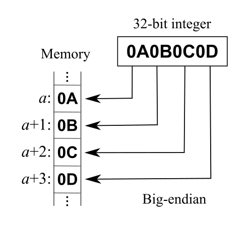
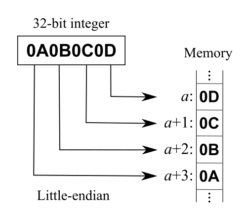
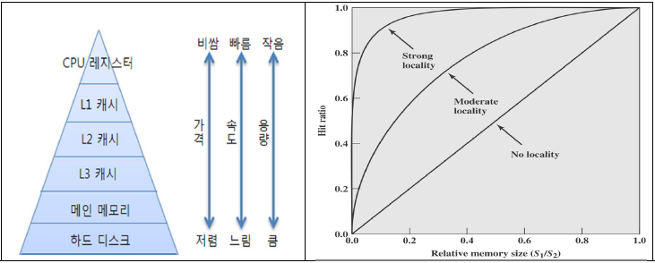

# 메모리와 캐시 메모리

---

## 1. 메모리 개요

실행 중인 프로그램은 메모리에 적재된다.  
CPU는 메모리에 저장된 **데이터와 명령어**를 읽고, 쓰고, 실행한다.

프로그램은 보통 보조기억장치에 저장되어 있다.

```text
보조기억장치
  ↓ 프로그램 실행 시 메모리로 복사
메모리
  ↓ CPU가 데이터와 명령어를 읽음
CPU
```

CPU는 보조기억장치에 저장된 프로그램을 곧바로 실행하지 못한다.  
따라서 프로그램이 실행되기 위해서는 반드시 보조기억장치에서 메모리로 해당 프로그램을 복사해야 한다.

즉, 메모리는 **현재 실행 중인 프로그램의 데이터와 명령어를 저장하는 장치**이다.

---

## 2. RAM

**RAM(Random Access Memory)** 은 CPU가 실행할 대상인 데이터와 명령어를 저장하는 메모리이다.

RAM은 전원을 끄면 저장하고 있던 데이터와 명령어가 사라지는 **휘발성 저장장치**이다.

```text
컴퓨터 전원 ON  → RAM에 데이터 유지
컴퓨터 전원 OFF → RAM의 데이터 삭제
```

따라서 RAM은 프로그램을 영구히 보관하는 장치가 아니라, **실행 중인 프로그램을 임시로 저장하는 장치**이다.

예를 들어 Java 프로그램을 실행한다고 하면 다음과 같은 흐름이 발생한다.

```text
보조기억장치에 저장된 .class 또는 .jar 파일
        ↓ 실행
RAM에 적재
        ↓
JVM과 CPU가 명령어와 데이터를 처리
```

---

### 임의 접근

RAM의 `Random Access`는 **임의 접근**을 의미한다.

임의 접근이란 저장된 데이터에 순차적으로 접근할 필요 없이, 원하는 위치에 바로 접근할 수 있는 방식을 말한다.  
이를 **직접 접근**이라고도 한다.

예를 들어 100번지에 있는 데이터에 접근하고자 할 때, 1번지부터 99번지까지 순서대로 접근할 필요가 없다.

```text
순차 접근:
1번지 → 2번지 → 3번지 → ... → 100번지

임의 접근:
100번지로 바로 접근
```

이러한 특성 덕분에 RAM은 CPU가 필요한 데이터와 명령어를 빠르게 읽고 쓸 수 있다.

---

## 3. RAM의 종류

RAM의 종류에는 대표적으로 다음과 같은 것들이 있다.

| 종류 | 설명 | 주요 사용 위치 |
|------|------|----------------|
| DRAM | 시간이 지나면 데이터가 사라지므로 주기적 재충전이 필요한 RAM | 메인 메모리 |
| SRAM | 전원이 공급되는 동안 데이터가 유지되며, DRAM보다 빠른 RAM | 캐시 메모리 |
| SDRAM | 클럭 신호와 동기화되어 동작하는 DRAM | 메인 메모리 |
| DDR SDRAM | 한 클럭에 여러 번 데이터를 전송하여 대역폭을 높인 SDRAM | 현대 메인 메모리 |

---

### DRAM

**DRAM(Dynamic RAM)** 은 저장된 데이터가 시간이 지나면서 점차 사라지는 RAM이다.

따라서 DRAM은 데이터 소멸을 막기 위해 일정 주기로 데이터를 다시 저장해야 한다.  
이 과정을 **재충전(Refresh)** 이라고 한다.

```text
DRAM에 데이터 저장
        ↓
시간이 지나며 데이터 약화
        ↓
Refresh를 통해 데이터 유지
```

DRAM은 구조가 비교적 단순하여 용량을 크게 만들기 쉽고 가격이 저렴하다.  
따라서 일반적으로 컴퓨터의 **메인 메모리**로 사용된다.

---

### SRAM

**SRAM(Static RAM)** 은 DRAM과 달리 전원이 공급되는 동안 저장된 데이터가 사라지지 않는 RAM이다.

단, SRAM도 휘발성 저장장치이므로 전원이 차단되면 데이터는 사라진다.

SRAM은 DRAM보다 빠르지만, 가격이 비싸고 집적도가 낮다.  
즉, 같은 공간에 저장할 수 있는 데이터 양이 DRAM보다 적다.

| 구분 | DRAM | SRAM |
|------|------|------|
| 속도 | 상대적으로 느림 | 빠름 |
| 가격 | 저렴함 | 비쌈 |
| 집적도 | 높음 | 낮음 |
| Refresh 필요 여부 | 필요 | 불필요 |
| 주 사용 위치 | 메인 메모리 | 캐시 메모리 |

SRAM은 속도가 빠르기 때문에 CPU와 가까운 **캐시 메모리**에 사용된다.

---

### SDRAM

**SDRAM(Synchronous Dynamic RAM)** 은 클럭 신호와 동기화되어 동작하는 DRAM이다.

여기서 `Synchronous`는 **동기화된**이라는 의미이다.  
즉, SDRAM은 시스템 클럭 타이밍에 맞춰 CPU와 데이터를 주고받는다.

```text
클럭 신호
  ↓
SDRAM이 클럭에 맞춰 데이터 전송
```

SDRAM은 기존 DRAM보다 더 효율적으로 CPU와 데이터를 주고받을 수 있다.

---

### DDR SDRAM

**DDR SDRAM(Double Data Rate SDRAM)** 은 SDRAM보다 더 넓은 대역폭을 제공하는 메모리이다.

**대역폭(Bandwidth)** 은 데이터를 주고받는 통로의 너비라고 이해할 수 있다.  
대역폭이 넓을수록 한 번에 더 많은 데이터를 주고받을 수 있다.

일반 SDRAM이 한 클럭당 한 번 데이터를 주고받는다면, DDR SDRAM은 한 클럭당 두 번 데이터를 주고받을 수 있다.

```text
SDR SDRAM: 한 클럭에 1번 데이터 전송
DDR SDRAM: 한 클럭에 2번 데이터 전송
```

DDR 계열의 대역폭은 다음과 같이 발전했다.

| 종류 | SDR SDRAM 대비 대역폭 |
|------|------------------------|
| SDR SDRAM | 1배 |
| DDR SDRAM | 2배 |
| DDR2 SDRAM | 4배 |
| DDR3 SDRAM | 8배 |
| DDR4 SDRAM | 16배 |

즉, DDR 세대가 발전할수록 한 번에 전송할 수 있는 데이터 양이 증가한다.

---

## 4. 빅 엔디안과 리틀 엔디안

현대의 메모리는 대부분 데이터를 **바이트 단위**로 저장하고 관리한다.

CPU는 4바이트 또는 8바이트인 워드 단위로 데이터를 처리할 수 있다.  
하지만 메모리는 이 데이터를 여러 바이트로 나누어 연속된 주소에 저장한다.

이때 여러 바이트를 어떤 순서로 저장하는지에 따라 다음 두 방식으로 나뉜다.

```text
빅 엔디안
리틀 엔디안
```

예를 들어 4바이트 데이터 `0x12345678`을 메모리에 저장한다고 하자.

```text
데이터: 0x12345678
바이트 단위: 12 / 34 / 56 / 78
```

이 바이트들을 낮은 주소부터 어떤 순서로 저장하는지가 엔디안 방식의 차이이다.

---

### 빅 엔디안



**빅 엔디안(Big Endian)** 은 낮은 번지의 주소에 **상위 바이트**부터 저장하는 방식이다.

예를 들어 `0x12345678`을 100번지부터 저장한다고 하면 다음과 같다.

| 메모리 주소 | 저장 값 |
|------------|---------|
| 100번지 | 12 |
| 101번지 | 34 |
| 102번지 | 56 |
| 103번지 | 78 |

```text
낮은 주소 → 높은 주소
12 → 34 → 56 → 78
```

여기서 `12`는 숫자 전체에서 가장 큰 자리 쪽에 해당하는 바이트이다.  
이처럼 큰 자리의 바이트를 먼저 저장하기 때문에 빅 엔디안이라고 부른다.

빅 엔디안은 사람이 숫자를 읽는 순서와 비슷하다.

```text
0x12345678
   ↓
12 34 56 78
```

---

### 리틀 엔디안



**리틀 엔디안(Little Endian)** 은 낮은 번지의 주소에 **하위 바이트**부터 저장하는 방식이다.

예를 들어 `0x12345678`을 100번지부터 저장한다고 하면 다음과 같다.

| 메모리 주소 | 저장 값 |
|------------|---------|
| 100번지 | 78 |
| 101번지 | 56 |
| 102번지 | 34 |
| 103번지 | 12 |

```text
낮은 주소 → 높은 주소
78 → 56 → 34 → 12
```

여기서 `78`은 숫자 전체에서 가장 작은 자리 쪽에 해당하는 바이트이다.  
이처럼 작은 자리의 바이트를 먼저 저장하기 때문에 리틀 엔디안이라고 부른다.

---

### 빅 엔디안과 리틀 엔디안 비교

| 구분 | 빅 엔디안 | 리틀 엔디안 |
|------|-----------|-------------|
| 저장 순서 | 상위 바이트부터 저장 | 하위 바이트부터 저장 |
| 낮은 주소에 저장되는 값 | 가장 큰 자리의 바이트 | 가장 작은 자리의 바이트 |
| 예시 `0x12345678` | `12 34 56 78` | `78 56 34 12` |
| 특징 | 사람이 읽는 순서와 유사 | 일부 연산 처리에 유리할 수 있음 |

엔디안은 데이터가 메모리에 저장되는 **바이트 순서**를 의미한다.  
비트 하나하나의 순서를 뒤집는 개념이 아니라, 여러 바이트로 구성된 데이터를 메모리에 어떤 바이트 순서로 저장할지에 관한 개념이다.

---

## 5. 캐시 메모리


CPU는 프로그램을 실행하는 과정에서 메모리에 매우 자주 접근한다.

하지만 CPU의 연산 속도는 메모리 접근 속도보다 훨씬 빠르다.  
따라서 CPU가 매번 메모리에서 데이터를 가져와야 한다면, CPU는 메모리 응답을 기다리는 시간이 많아진다.

```text
CPU는 빠름
메모리는 상대적으로 느림
        ↓
CPU가 메모리를 기다리는 시간 발생
```

이 문제를 줄이기 위해 등장한 장치가 **캐시 메모리(Cache Memory)** 이다.

캐시 메모리는 CPU와 메모리 사이에 위치한 **SRAM 기반의 고속 저장장치**이다.  
CPU가 자주 사용할 것으로 예상되는 메모리의 일부 데이터를 캐시 메모리에 저장해 두고, CPU가 이를 빠르게 사용할 수 있도록 한다.

```text
CPU
  ↓
캐시 메모리
  ↓
메인 메모리
```

즉, 캐시 메모리의 목적은 **CPU와 메모리 사이의 속도 차이를 줄이는 것**이다.

---

### 캐시 메모리 계층



캐시 메모리는 보통 CPU 코어에 가까운 순서대로 L1, L2, L3 캐시로 나뉜다.

| 구분 | 위치 | 특징 |
|------|------|------|
| L1 캐시 | CPU 코어에 가장 가까움 | 가장 빠르지만 용량이 작음 |
| L2 캐시 | L1보다 바깥쪽 | L1보다 느리지만 용량이 큼 |
| L3 캐시 | 여러 코어가 공유하는 경우가 많음 | L2보다 느리지만 더 큰 용량 |

일반적인 속도와 용량 관계는 다음과 같다.

```text
속도: L1 > L2 > L3 > 메인 메모리
용량: L1 < L2 < L3 < 메인 메모리
```

CPU가 데이터를 필요로 할 때는 보통 다음 순서로 접근한다.

```text
1. L1 캐시 확인
2. L2 캐시 확인
3. L3 캐시 확인
4. 메인 메모리 접근
```

캐시에 데이터가 있으면 메모리에 접근하지 않아도 되므로 성능이 향상된다.

---

## 6. 캐시 히트, 캐시 미스, 참조 지역성

### 캐시 히트

**캐시 히트(Cache Hit)** 는 CPU가 필요로 하는 데이터가 캐시 메모리에 있는 경우를 말한다.

```text
CPU가 데이터 요청
        ↓
캐시에 데이터 존재
        ↓
캐시에서 빠르게 데이터 반환
```

캐시 히트가 발생하면 CPU는 메인 메모리까지 접근하지 않아도 되므로 빠르게 데이터를 사용할 수 있다.

---

### 캐시 미스

**캐시 미스(Cache Miss)** 는 CPU가 필요로 하는 데이터가 캐시 메모리에 없는 경우를 말한다.

```text
CPU가 데이터 요청
        ↓
캐시에 데이터 없음
        ↓
메인 메모리에서 데이터 가져옴
        ↓
캐시에 저장 후 CPU에 전달
```

캐시 미스가 발생하면 메인 메모리에 접근해야 하므로 시간이 더 오래 걸린다.

---

### 캐시 적중률

**캐시 적중률(Cache Hit Ratio)** 은 CPU가 요청한 데이터 중 캐시에서 찾은 데이터의 비율을 의미한다.

```text
캐시 적중률 = 캐시 히트 횟수 / 전체 메모리 접근 횟수
```

또는 다음과 같이 표현할 수 있다.

```text
캐시 적중률 = 캐시 히트 횟수 / (캐시 히트 횟수 + 캐시 미스 횟수)
```

캐시 적중률이 높을수록 CPU가 메모리를 기다리는 시간이 줄어들어 전체 성능이 향상된다.

---

### 참조 지역성의 원리

캐시 메모리는 아무 데이터나 무작위로 저장하지 않는다.  
CPU가 앞으로 사용할 가능성이 높은 데이터를 저장한다.

이 예측의 근거가 되는 원리가 **참조 지역성의 원리(Locality of Reference)** 이다.

참조 지역성은 프로그램이 메모리에 접근할 때 일정한 경향을 보인다는 원리이다.

대표적인 참조 지역성은 다음 두 가지이다.

| 종류 | 설명 |
|------|------|
| 시간 지역성 | 최근 사용한 데이터는 다시 사용될 가능성이 높다. |
| 공간 지역성 | 사용한 데이터 근처의 데이터도 사용될 가능성이 높다. |

---

### 시간 지역성

**시간 지역성(Temporal Locality)** 은 최근에 접근한 데이터가 가까운 시간 안에 다시 접근될 가능성이 높다는 원리이다.

예를 들어 반복문에서 같은 변수를 계속 사용하는 경우를 생각할 수 있다.

```java
int sum = 0;

for (int i = 0; i < 100; i++) {
    sum += i;
}
```

위 코드에서 `sum`과 `i`는 반복문이 실행되는 동안 계속 사용된다.  
따라서 이러한 데이터는 캐시에 저장해 두면 다시 사용할 가능성이 높다.

```text
최근 사용한 데이터
        ↓
곧 다시 사용될 가능성 높음
```

---

### 공간 지역성

**공간 지역성(Spatial Locality)** 은 접근한 데이터 주변의 데이터도 곧 접근될 가능성이 높다는 원리이다.

예를 들어 배열을 순차적으로 탐색하는 경우를 보자.

```java
int[] numbers = {1, 2, 3, 4, 5};

for (int i = 0; i < numbers.length; i++) {
    System.out.println(numbers[i]);
}
```

배열의 `numbers[0]`에 접근했다면, 이후 `numbers[1]`, `numbers[2]`에도 접근할 가능성이 높다.

```text
numbers[0] 접근
        ↓
numbers[1], numbers[2]도 곧 접근할 가능성 높음
```

캐시는 이러한 공간 지역성을 활용하기 위해 데이터를 하나만 가져오지 않고, 주변 데이터까지 함께 가져오는 경우가 많다.

이를 **캐시 라인(Cache Line)** 단위로 가져온다고 표현한다.

---

### 배열과 연결 리스트의 지역성 차이

Java의 배열은 메모리상에서 비교적 연속적인 구조를 가진다.  
따라서 순차 접근 시 공간 지역성을 잘 활용할 수 있다.

```java
int[] arr = new int[1000];
```

반면 연결 리스트는 각 노드가 메모리의 서로 다른 위치에 흩어져 있을 수 있다.

```java
LinkedList<Integer> list = new LinkedList<>();
```

따라서 순차적으로 데이터를 읽더라도 배열보다 캐시 효율이 낮을 수 있다.

| 자료구조 | 공간 지역성 |
|----------|-------------|
| 배열 | 좋음 |
| 연결 리스트 | 상대적으로 낮음 |

이 때문에 단순 순차 탐색에서는 배열이 연결 리스트보다 더 빠른 경우가 많다.

---

## 7. 캐시 메모리의 쓰기 정책과 일관성

CPU가 데이터를 읽는 경우에는 캐시에서 빠르게 읽으면 된다.  
하지만 데이터를 쓰는 경우에는 문제가 조금 더 복잡하다.

예를 들어 CPU가 캐시에 있는 값을 수정했다고 하자.

```text
캐시의 값은 변경됨
메모리의 값은 아직 변경되지 않음
```

이 경우 캐시와 메모리의 데이터가 서로 달라질 수 있다.  
따라서 캐시 쓰기 정책이 필요하다.

대표적인 캐시 쓰기 정책은 다음 두 가지이다.

| 정책 | 설명 |
|------|------|
| 즉시 쓰기 | 캐시와 메모리에 동시에 데이터를 반영 |
| 지연 쓰기 | 캐시에 먼저 반영하고, 나중에 메모리에 반영 |

---

### 즉시 쓰기

**즉시 쓰기(Write-Through)** 는 CPU가 캐시에 데이터를 쓸 때, 메인 메모리에도 즉시 반영하는 방식이다.

```text
CPU가 데이터 수정
        ↓
캐시에 반영
        ↓
메모리에도 즉시 반영
```

즉시 쓰기의 장점은 캐시와 메모리의 데이터가 항상 비교적 일관되게 유지된다는 점이다.

하지만 매번 메모리에도 쓰기 작업을 해야 하므로 성능이 떨어질 수 있다.

| 장점 | 단점 |
|------|------|
| 데이터 일관성 유지가 비교적 쉬움 | 메모리 쓰기 작업이 많아져 느릴 수 있음 |

---

### 지연 쓰기

**지연 쓰기(Write-Back)** 는 CPU가 데이터를 수정할 때 우선 캐시에만 반영하고, 나중에 필요한 시점에 메모리에 반영하는 방식이다.

```text
CPU가 데이터 수정
        ↓
캐시에만 반영
        ↓
나중에 메모리에 반영
```

지연 쓰기는 메모리 접근 횟수를 줄일 수 있기 때문에 성능상 유리하다.

하지만 캐시와 메모리의 값이 일시적으로 달라질 수 있으므로, 데이터 일관성 관리가 더 복잡하다.

| 장점 | 단점 |
|------|------|
| 메모리 접근 횟수가 줄어 성능에 유리 | 캐시와 메모리의 일관성 관리가 복잡함 |

---

### 캐시 일관성

**캐시 일관성(Cache Coherence)** 은 여러 캐시나 메모리에 저장된 같은 데이터가 서로 모순되지 않도록 관리하는 문제이다.

특히 멀티코어 CPU에서는 각 코어가 자신만의 캐시를 가질 수 있다.

```text
Core 1 → L1 Cache
Core 2 → L1 Cache
Core 3 → L1 Cache
```

이때 여러 코어가 같은 메모리 데이터를 캐시에 저장하고 있다면 문제가 발생할 수 있다.

예를 들어 다음과 같은 상황을 생각할 수 있다.

```text
메모리의 X = 10

Core 1의 캐시: X = 10
Core 2의 캐시: X = 10

Core 1이 X를 20으로 수정
```

이 경우 Core 2의 캐시에는 여전히 `X = 10`이 남아 있을 수 있다.

```text
Core 1의 캐시: X = 20
Core 2의 캐시: X = 10
메모리: X = 10 또는 20
```

이처럼 같은 데이터에 대해 캐시마다 다른 값을 가지고 있으면 일관성 문제가 발생한다.

따라서 현대 CPU는 캐시 일관성을 유지하기 위한 다양한 프로토콜을 사용한다.  
대표적으로 MESI 프로토콜과 같은 캐시 일관성 프로토콜이 있다.

---

## 8. 정리

- 실행 중인 프로그램은 메모리에 적재된다.
- CPU는 메모리에 저장된 데이터와 명령어를 읽고, 쓰고, 실행한다.
- RAM은 CPU가 실행할 대상을 저장하는 휘발성 저장장치이다.
- CPU는 보조기억장치의 프로그램을 직접 실행하지 못하므로, 프로그램은 실행 전에 메모리에 적재되어야 한다.
- RAM은 임의 접근이 가능하므로 원하는 주소에 직접 접근할 수 있다.
- DRAM은 시간이 지나면 데이터가 사라지므로 주기적인 Refresh가 필요하다.
- SRAM은 DRAM보다 빠르지만 비싸며, 주로 캐시 메모리에 사용된다.
- SDRAM은 클럭 신호와 동기화되어 동작하는 DRAM이다.
- DDR SDRAM은 대역폭을 높여 한 클럭에 더 많은 데이터를 전송할 수 있는 SDRAM이다.
- 빅 엔디안은 낮은 주소에 상위 바이트부터 저장하는 방식이다.
- 리틀 엔디안은 낮은 주소에 하위 바이트부터 저장하는 방식이다.
- 캐시 메모리는 CPU와 메모리 사이의 속도 차이를 줄이기 위한 SRAM 기반 저장장치이다.
- CPU는 일반적으로 L1, L2, L3 캐시 순서로 데이터를 확인한다.
- 캐시 히트는 필요한 데이터가 캐시에 있는 경우이다.
- 캐시 미스는 필요한 데이터가 캐시에 없어 메인 메모리에 접근해야 하는 경우이다.
- 캐시 적중률이 높을수록 전체 성능이 향상된다.
- 참조 지역성에는 시간 지역성과 공간 지역성이 있다.
- 시간 지역성은 최근 사용한 데이터가 다시 사용될 가능성이 높다는 원리이다.
- 공간 지역성은 사용한 데이터 주변의 데이터도 사용될 가능성이 높다는 원리이다.
- 즉시 쓰기는 데이터를 캐시와 메모리에 동시에 반영하는 방식이다.
- 지연 쓰기는 데이터를 캐시에 먼저 반영하고 나중에 메모리에 반영하는 방식이다.
- 멀티코어 환경에서는 캐시 일관성 문제가 발생할 수 있다.

---

## 9. 핵심 키워드

- Memory
- RAM
- Random Access Memory
- Volatile Memory
- DRAM
- SRAM
- SDRAM
- DDR SDRAM
- Bandwidth
- Big Endian
- Little Endian
- MSB
- LSB
- Cache Memory
- SRAM Cache
- L1 Cache
- L2 Cache
- L3 Cache
- Cache Hit
- Cache Miss
- Cache Hit Ratio
- Locality of Reference
- Temporal Locality
- Spatial Locality
- Cache Line
- Write-Through
- Write-Back
- Cache Coherence
- MESI Protocol

---

## 참고

해당 내용은 강민철, 『이것이 취업을 위한 컴퓨터 과학이다』를 학습하며 정리한 내용을 바탕으로 작성하였다.
