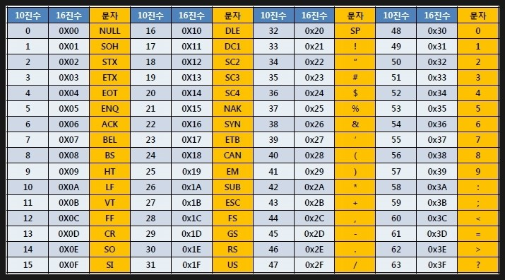
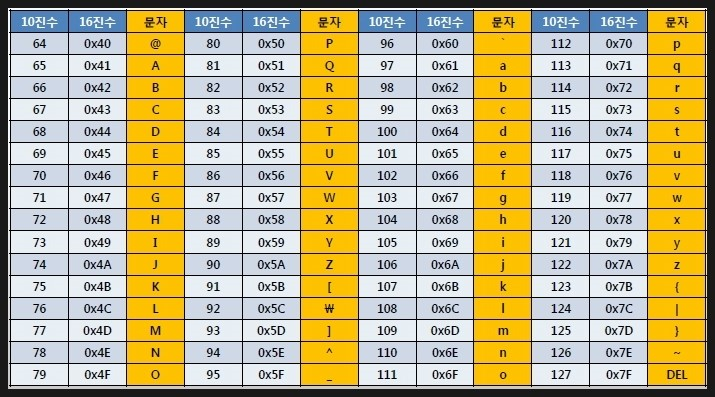

# 컴퓨터 구조의 큰 그림

---

## 1. 컴퓨터 구조란?

**컴퓨터 구조(Computer Architecture)** 는 컴퓨터가 어떤 정보를 이해하고, 그 정보를 어떤 부품들이 처리하는지를 다루는 분야이다.

컴퓨터 구조는 크게 다음 두 가지 관점으로 나누어 이해할 수 있다.

```text
컴퓨터 구조
├── 컴퓨터가 이해하는 정보
│   ├── 데이터
│   └── 명령어
│
└── 컴퓨터의 핵심 부품
    ├── CPU
    ├── 메모리와 캐시 메모리
    ├── 보조기억장치
    └── 입출력장치
```

즉, 컴퓨터 구조를 이해하려면 먼저 컴퓨터가 처리하는 정보인 **데이터와 명령어**를 이해해야 하고, 그 다음 이 정보를 처리하는 핵심 부품인 **CPU, 메모리, 보조기억장치, 입출력장치**를 이해해야 한다.

---

# 2. 컴퓨터가 이해하는 정보

---

## 2.1 컴퓨터는 프로그래밍 언어를 직접 이해하지 못한다

컴퓨터는 Java, C++, Python과 같은 프로그래밍 언어를 직접 이해하지 못한다.

사람이 작성한 프로그래밍 언어는 컴파일러나 인터프리터를 통해 컴퓨터가 이해할 수 있는 형태로 변환된다.

컴퓨터가 최종적으로 이해할 수 있는 정보는 크게 두 가지이다.

| 구분 | 설명 |
|------|------|
| 데이터 | 숫자, 문자, 이미지, 동영상과 같은 정적인 정보 |
| 명령어 | 데이터를 어떻게 처리할지 지시하는 정보 |

즉, 컴퓨터는 기본적으로 **데이터와 명령어**만 이해할 수 있다.

---

## 2.2 데이터란?

**데이터(Data)** 는 컴퓨터가 처리하는 정적인 정보를 의미한다.

예를 들어 다음과 같은 것들이 데이터에 해당한다.

```text
숫자
문자
이미지
동영상
파일
사용자 입력값
```

컴퓨터와 주고받는 정보나 컴퓨터에 저장된 정보 자체를 통칭해서 데이터라고 부르기도 한다.

데이터는 명령어와 분리해서 생각할 수 있지만, 실제 컴퓨터의 실행 관점에서는 명령어에 의해 사용되는 대상이다.

즉, 데이터는 다음과 같은 성격을 가진다.

- 명령어의 대상
- 명령어의 재료
- 명령어에 종속적인 정보

예를 들어 다음과 같은 명령이 있다고 하자.

```text
10과 20을 더하라
```

여기서 `10`과 `20`은 데이터이고, `더하라`는 명령어이다.

---

## 2.3 명령어란?

**명령어(Instruction)** 는 컴퓨터가 수행해야 할 작업을 지시하는 정보이다.

컴퓨터는 명령어를 읽고, 해석하고, 실행한다.

예를 들어 다음과 같은 작업들이 명령어로 표현될 수 있다.

```text
메모리에서 데이터를 가져와라
두 값을 더하라
결과를 메모리에 저장하라
특정 위치의 명령어로 이동하라
입출력장치에서 데이터를 읽어라
```

컴퓨터 프로그램은 결국 수많은 명령어와 데이터로 이루어져 있다.

---

## 2.4 데이터와 명령어는 0과 1로 표현된다

컴퓨터는 기본적으로 전기 신호를 기반으로 동작한다.

전기 신호의 상태는 단순하게 다음 두 가지로 표현할 수 있다.

```text
전기 신호가 꺼짐 → 0
전기 신호가 켜짐 → 1
```

따라서 컴퓨터 내부의 데이터와 명령어는 모두 **0과 1**로 표현된다.

```text
데이터 → 0과 1
명령어 → 0과 1
```

CPU는 0과 1로 이루어진 데이터를 활용하여 0과 1로 이루어진 명령어를 실행한다.

---

# 3. 컴퓨터의 핵심 부품

---

## 3.1 컴퓨터의 핵심 부품 개요

컴퓨터의 핵심 부품은 다음과 같다.

| 부품 | 역할 |
|------|------|
| CPU | 명령어를 읽고 해석하고 실행하는 장치 |
| 메모리 | 현재 실행 중인 프로그램의 데이터와 명령어를 저장하는 장치 |
| 캐시 메모리 | CPU가 메모리에 더 빠르게 접근하기 위해 사용하는 저장장치 |
| 보조기억장치 | 전원이 꺼져도 데이터를 보관하는 저장장치 |
| 입출력장치 | 컴퓨터 외부와 정보를 주고받는 장치 |
| 메인보드 | 핵심 부품들이 연결되는 기판 |
| 버스 | 부품들이 정보를 주고받는 통로 |

---

# 4. CPU

---

## 4.1 CPU란?

**CPU(Central Processing Unit)** 는 컴퓨터의 중앙처리장치이다.

CPU는 컴퓨터가 이해하는 정보인 **데이터와 명령어**를 읽어 들이고, 해석하고, 실행한다.

사람의 몸에 비유하면 CPU는 두뇌와 같은 역할을 한다.

```text
메모리에서 명령어 읽기
        ↓
명령어 해석
        ↓
데이터 연산
        ↓
결과 저장
```

CPU의 핵심 구성 요소는 다음과 같다.

| 구성 요소 | 설명 |
|----------|------|
| ALU | 산술 연산과 논리 연산 수행 |
| 제어장치 | 명령어 해석 및 제어 신호 생성 |
| 레지스터 | CPU 내부의 임시 저장장치 |

---

## 4.2 ALU

**ALU(Arithmetic and Logic Unit)** 는 산술논리연산장치이다.

ALU는 CPU 내부에서 실제 연산을 수행하는 장치이다.

ALU가 수행하는 대표적인 연산은 다음과 같다.

| 연산 종류 | 예시 |
|----------|------|
| 산술 연산 | 덧셈, 뺄셈, 곱셈, 나눗셈 |
| 논리 연산 | AND, OR, NOT, XOR |
| 비교 연산 | 크다, 작다, 같다 |

예를 들어 다음과 같은 명령어가 있다고 하자.

```text
10 + 20
```

이때 실제로 `10`과 `20`을 더하는 작업은 ALU가 수행한다.

---

## 4.3 제어장치

**제어장치(CU, Control Unit)** 는 명령어를 해석하고, 컴퓨터 부품들이 올바르게 동작하도록 제어 신호를 내보내는 장치이다.

여기서 **제어 신호(Control Signal)** 란 컴퓨터 부품을 작동시키기 위한 전기 신호를 의미한다.

예를 들어 제어장치는 다음과 같은 신호를 보낼 수 있다.

```text
메모리에서 데이터를 읽어라
메모리에 데이터를 저장하라
ALU에게 덧셈을 수행시켜라
입출력장치에서 데이터를 가져와라
```

즉, 제어장치는 CPU 내부와 외부 부품들이 명령어에 맞게 동작하도록 지휘하는 역할을 한다.

---

## 4.4 레지스터

**레지스터(Register)** 는 CPU 내부에 있는 작은 임시 저장장치이다.

CPU는 명령어를 처리하는 동안 여러 중간값을 저장해야 한다.  
이때 사용하는 매우 빠른 저장장치가 레지스터이다.

레지스터에는 다음과 같은 정보가 저장될 수 있다.

```text
현재 실행 중인 명령어
다음에 실행할 명령어의 주소
연산에 사용할 데이터
연산 결과
메모리 주소
```

레지스터는 CPU 내부에 존재하기 때문에 메모리보다 훨씬 빠르다.  
대신 용량은 매우 작다.

---

## 4.5 대표적인 레지스터

CPU마다 레지스터의 종류와 이름은 다를 수 있지만, 대표적으로 다음과 같은 레지스터들이 있다.

| 레지스터 | 설명 |
|----------|------|
| 프로그램 카운터(PC) | 다음에 실행할 명령어의 주소 저장 |
| 명령어 레지스터(IR) | 현재 실행 중인 명령어 저장 |
| 메모리 주소 레지스터(MAR) | 메모리에 접근할 주소 저장 |
| 메모리 버퍼 레지스터(MBR) | 메모리와 주고받을 데이터 저장 |
| 범용 레지스터 | 다양한 데이터와 중간 결과 저장 |
| 플래그 레지스터 | 연산 결과의 상태 정보 저장 |

---

## 4.6 CPU의 동작 흐름

CPU는 일반적으로 다음 흐름으로 명령어를 처리한다.

```text
1. 메모리에서 명령어를 가져온다.
2. 명령어를 해석한다.
3. 필요한 데이터를 가져온다.
4. ALU가 연산을 수행한다.
5. 결과를 레지스터나 메모리에 저장한다.
6. 다음 명령어로 이동한다.
```

이러한 반복 과정을 통해 프로그램이 실행된다.

---

# 5. 메인 메모리와 캐시 메모리

---

## 5.1 메인 메모리란?

**메인 메모리(Main Memory)** 는 현재 실행 중인 프로그램의 데이터와 명령어를 저장하는 장치이다.

일반적으로 메모리라고 하면 **RAM(Random Access Memory)** 을 의미한다.

CPU가 명령어를 실행하려면 해당 명령어와 데이터가 어딘가에 저장되어 있어야 한다.  
이때 실행 중인 프로그램의 명령어와 데이터가 저장되는 곳이 메인 메모리이다.

```text
보조기억장치에 저장된 프로그램
        ↓ 실행 시
메모리에 적재
        ↓
CPU가 메모리에서 명령어와 데이터 읽기
```

프로그램이 실행되기 위해서는 반드시 해당 프로그램을 구성하는 데이터와 명령어가 메모리에 적재되어야 한다.

---

## 5.2 메모리의 주소

메모리에 저장된 데이터와 명령어에 접근하려면 위치 정보가 필요하다.

이 위치 정보를 **주소(Address)** 라고 한다.

```text
주소 1000번지 → 데이터 A
주소 1001번지 → 데이터 B
주소 1002번지 → 명령어 C
```

CPU는 메모리의 주소를 이용해 원하는 데이터나 명령어에 접근한다.

예를 들어 CPU가 다음과 같이 요청할 수 있다.

```text
1000번지에 저장된 데이터를 읽어라
1002번지에 저장된 명령어를 가져와라
```

주소는 메모리에 저장된 정보를 찾기 위한 식별자 역할을 한다.

---

## 5.3 메모리의 휘발성

메모리는 **휘발성(Volatile)** 저장장치이다.

휘발성이란 전원이 공급되지 않으면 저장된 정보가 사라지는 특성을 의미한다.

즉, 메모리에 저장된 데이터와 명령어는 컴퓨터가 켜져 있는 동안에만 유지된다.

```text
컴퓨터 전원 켜짐 → 메모리 데이터 유지
컴퓨터 전원 꺼짐 → 메모리 데이터 삭제
```

따라서 장기적으로 보관해야 하는 데이터는 메모리가 아니라 보조기억장치에 저장해야 한다.

---

## 5.4 캐시 메모리란?

**캐시 메모리(Cache Memory)** 는 CPU가 메모리에 더 빠르게 접근하기 위해 사용하는 고속 저장장치이다.

CPU는 매우 빠르게 동작하지만, 메인 메모리는 CPU에 비해 상대적으로 느리다.  
이 속도 차이를 줄이기 위해 CPU와 메모리 사이에 캐시 메모리를 둔다.

```text
CPU
 ↓
캐시 메모리
 ↓
메인 메모리
```

캐시 메모리는 CPU가 자주 사용할 것으로 예상되는 데이터와 명령어를 미리 저장한다.

CPU가 필요한 데이터를 캐시에서 찾으면 메모리까지 접근하지 않아도 되므로 더 빠르게 처리할 수 있다.

---

## 5.5 캐시 메모리의 계층 구조

캐시 메모리는 보통 여러 계층으로 구성된다.

| 캐시 | 설명 |
|------|------|
| L1 Cache | CPU 코어에 가장 가까운 캐시, 가장 빠르지만 용량이 작음 |
| L2 Cache | L1보다 느리지만 더 큰 용량 |
| L3 Cache | 여러 코어가 공유하는 경우가 많으며 L2보다 더 큼 |

일반적인 접근 속도는 다음과 같다.

```text
레지스터 > L1 캐시 > L2 캐시 > L3 캐시 > 메인 메모리 > 보조기억장치
```

가까울수록 빠르지만 용량은 작고, 멀수록 느리지만 용량은 크다.

---

## 5.6 저장장치 계층 구조

컴퓨터의 저장장치는 속도와 용량에 따라 계층 구조를 가진다.

| 저장장치 | 속도 | 용량 | 특징 |
|---------|------|------|------|
| 레지스터 | 가장 빠름 | 매우 작음 | CPU 내부 저장장치 |
| 캐시 메모리 | 매우 빠름 | 작음 | CPU와 메모리 사이 |
| 메인 메모리 | 빠름 | 중간 | 실행 중인 프로그램 저장 |
| 보조기억장치 | 느림 | 큼 | 장기 보관용 저장장치 |

이 계층 구조는 CPU가 최대한 빠르게 데이터를 처리하면서도, 많은 데이터를 저장할 수 있도록 설계된 구조이다.

---

# 6. 보조기억장치

---

## 6.1 보조기억장치란?

**보조기억장치(Secondary Storage)** 는 전원이 꺼져도 데이터를 보관할 수 있는 저장장치이다.

메모리는 휘발성이므로 전원이 꺼지면 저장된 정보가 사라진다.  
이를 보완하기 위해 비휘발성 저장장치인 보조기억장치를 사용한다.

보조기억장치의 예시는 다음과 같다.

```text
하드 디스크 드라이브(HDD)
SSD
USB 메모리
CD-ROM
DVD
플래시 메모리
```

---

## 6.2 메모리와 보조기억장치의 차이

| 구분 | 메인 메모리 | 보조기억장치 |
|------|------------|--------------|
| 용도 | 현재 실행 중인 프로그램 저장 | 보관할 프로그램과 데이터 저장 |
| 휘발성 | 휘발성 | 비휘발성 |
| 속도 | 빠름 | 상대적으로 느림 |
| 용량 | 상대적으로 작음 | 큼 |
| 예시 | RAM | HDD, SSD, USB |

메모리는 현재 실행 중인 프로그램을 저장한다.  
보조기억장치는 실행하지 않는 프로그램이나 파일을 장기적으로 보관한다.

---

## 6.3 프로그램 실행과 보조기억장치

프로그램은 보통 보조기억장치에 저장되어 있다.

하지만 CPU는 보조기억장치에 있는 프로그램을 직접 실행하지 않는다.  
프로그램이 실행되기 위해서는 먼저 보조기억장치에서 메모리로 복사되어야 한다.

```text
보조기억장치에 저장된 프로그램
        ↓ 실행 요청
메모리로 적재
        ↓
CPU가 메모리에서 명령어 읽기
        ↓
프로그램 실행
```

즉, 프로그램 실행의 기본 흐름은 다음과 같다.

```text
보조기억장치 → 메모리 → CPU
```

---

# 7. 입출력장치

---

## 7.1 입출력장치란?

**입출력장치(I/O Device)** 는 컴퓨터 외부에 연결되어 컴퓨터 내부와 정보를 주고받는 장치이다.

입출력장치는 크게 입력장치와 출력장치로 나눌 수 있다.

| 구분 | 설명 | 예시 |
|------|------|------|
| 입력장치 | 컴퓨터에 데이터를 입력하는 장치 | 키보드, 마우스, 마이크, 스캐너 |
| 출력장치 | 컴퓨터의 처리 결과를 사용자에게 전달하는 장치 | 모니터, 스피커, 프린터 |

---

## 7.2 입력장치

**입력장치(Input Device)** 는 사용자나 외부 환경의 정보를 컴퓨터 내부로 전달하는 장치이다.

예시는 다음과 같다.

```text
키보드
마우스
마이크
웹캠
스캐너
터치스크린
```

예를 들어 키보드에서 글자를 입력하면, 해당 입력 정보가 컴퓨터 내부로 전달된다.

---

## 7.3 출력장치

**출력장치(Output Device)** 는 컴퓨터 내부의 정보를 사용자나 외부 장치로 전달하는 장치이다.

예시는 다음과 같다.

```text
모니터
스피커
프린터
프로젝터
```

예를 들어 CPU가 처리한 결과를 사용자가 볼 수 있도록 모니터에 출력한다.

---

# 8. 메인보드와 버스

---

## 8.1 메인보드란?

**메인보드(Main Board)** 또는 **마더보드(Motherboard)** 는 컴퓨터의 핵심 부품들이 연결되는 기판이다.

CPU, 메모리, 보조기억장치, 입출력장치 등은 모두 메인보드를 통해 서로 연결된다.

```text
CPU
메모리
보조기억장치
입출력장치
        ↓
     메인보드
```

메인보드는 각 부품들이 전기적으로 연결되어 정보를 주고받을 수 있도록 한다.

---

## 8.2 버스란?

**버스(Bus)** 는 컴퓨터 부품들이 정보를 주고받는 통로이다.

컴퓨터의 핵심 부품들은 각자의 역할을 수행하기 위해 서로 데이터를 주고받아야 한다.  
이때 사용하는 통신 경로가 버스이다.

```text
CPU ↔ 메모리
CPU ↔ 입출력장치
메모리 ↔ 보조기억장치
```

---

## 8.3 시스템 버스

버스에는 여러 종류가 있지만, 핵심 부품들을 연결하는 가장 중요한 버스는 **시스템 버스(System Bus)** 이다.

시스템 버스는 보통 다음 세 가지로 나눌 수 있다.

| 구분 | 설명 |
|------|------|
| 주소 버스 | 접근할 메모리 주소를 전달 |
| 데이터 버스 | 실제 데이터를 전달 |
| 제어 버스 | 읽기, 쓰기 등 제어 신호를 전달 |

예를 들어 CPU가 메모리에서 데이터를 읽는 과정은 다음과 같이 이해할 수 있다.

```text
1. CPU가 주소 버스를 통해 읽을 메모리 주소를 전달한다.
2. CPU가 제어 버스를 통해 읽기 신호를 보낸다.
3. 메모리가 데이터 버스를 통해 해당 데이터를 CPU로 전달한다.
```

---

# 9. 컴퓨터가 이해하는 정보 단위

---

## 9.1 비트

**비트(Bit)** 는 컴퓨터가 표현할 수 있는 가장 작은 정보 단위이다.

1비트는 두 가지 상태를 표현할 수 있다.

```text
0
1
```

즉, 1비트는 2개의 정보를 표현할 수 있다.

비트 수가 늘어나면 표현 가능한 정보의 수는 다음과 같이 증가한다.

| 비트 수 | 표현 가능한 정보 수 |
|--------|--------------------|
| 1비트 | 2개 |
| 2비트 | 4개 |
| 3비트 | 8개 |
| 4비트 | 16개 |
| N비트 | 2^N개 |

따라서 **N비트는 2^N개의 정보를 표현할 수 있다.**

---

## 9.2 바이트와 데이터 단위

프로그램이나 파일의 크기는 보통 바이트 단위로 표현한다.

**1바이트(Byte)** 는 8비트이다.

| 단위 | 크기 |
|------|------|
| 1 byte | 8 bit |
| 1 KB | 1,000 byte |
| 1 MB | 1,000 KB |
| 1 GB | 1,000 MB |
| 1 TB | 1,000 GB |

단, 컴퓨터 메모리 용량을 다룰 때는 2의 거듭제곱 단위도 자주 사용된다.

| 단위 | 크기 |
|------|------|
| 1 KiB | 1,024 byte |
| 1 MiB | 1,024 KiB |
| 1 GiB | 1,024 MiB |
| 1 TiB | 1,024 GiB |

정리하면 다음과 같다.

```text
KB, MB, GB → 보통 10진 단위
KiB, MiB, GiB → 2진 단위
```

실무와 교재에 따라 `KB`를 1,024바이트처럼 사용하는 경우도 있으므로 문맥에 따라 구분해야 한다.

---

## 9.3 워드

**워드(Word)** 는 CPU가 한 번에 처리할 수 있는 데이터의 크기를 의미한다.

CPU는 보통 워드 단위로 데이터를 읽고 처리한다.

예를 들어 다음과 같이 구분할 수 있다.

| CPU 구조 | 워드 크기 |
|---------|----------|
| 32비트 CPU | 32비트 |
| 64비트 CPU | 64비트 |

워드 크기가 클수록 CPU가 한 번에 처리할 수 있는 데이터의 크기가 커진다.

---

# 10. 데이터 표현: 0과 1로 숫자 표현하기

---

## 10.1 2진법

컴퓨터는 0과 1만 이해할 수 있으므로 내부적으로 숫자를 **2진법(Binary)** 으로 표현한다.

2진법은 숫자 `0`과 `1`만 사용하는 수 체계이다.

```text
10진수 2  → 2진수 10
10진수 3  → 2진수 11
10진수 4  → 2진수 100
10진수 5  → 2진수 101
```

2진법은 1을 넘어가는 시점에 자리올림한다.

---

## 10.2 10진법

**10진법(Decimal)** 은 사람이 일상적으로 사용하는 수 체계이다.

10진법은 다음 숫자들을 사용한다.

```text
0 1 2 3 4 5 6 7 8 9
```

10진법은 9를 넘어가는 시점에 자리올림한다.

```text
9 + 1 = 10
```

---

## 10.3 16진법

**16진법(Hexadecimal)** 은 16개의 기호를 사용하는 수 체계이다.

16진법은 다음 기호들을 사용한다.

```text
0 1 2 3 4 5 6 7 8 9 A B C D E F
```

여기서 `A`부터 `F`는 다음 값을 의미한다.

| 16진수 | 10진수 |
|-------|-------|
| A | 10 |
| B | 11 |
| C | 12 |
| D | 13 |
| E | 14 |
| F | 15 |

16진법은 15를 넘어가는 시점에 자리올림한다.

```text
F + 1 = 10
```

---

## 10.4 2진법과 16진법을 사용하는 이유

컴퓨터는 내부적으로 2진법을 사용하지만, 2진수는 길이가 길어 사람이 읽기 불편하다.

예를 들어 다음 2진수를 보자.

```text
11111111
```

이를 16진수로 표현하면 다음과 같다.

```text
FF
```

16진수는 2진수를 짧게 표현할 수 있어 메모리 주소, 색상 코드, 기계어 표현 등에 자주 사용된다.

예를 들어 Java에서도 2진수와 16진수를 다음과 같이 표현할 수 있다.

```java
int binary = 0b1010; // 2진수, 10진수로 10
int hex = 0x0A;      // 16진수, 10진수로 10
```

---

## 10.5 음수 표현과 2의 보수

컴퓨터는 음수도 0과 1로 표현해야 한다.

현대 컴퓨터에서는 일반적으로 **2의 보수(Two's Complement)** 방식을 사용해 음수를 표현한다.

예를 들어 8비트에서 `+1`은 다음과 같다.

```text
00000001
```

`-1`은 2의 보수 방식으로 다음과 같이 표현된다.

```text
11111111
```

2의 보수 방식은 덧셈 회로만으로 뺄셈을 처리할 수 있어 하드웨어 구현에 유리하다.

---

# 11. 데이터 표현: 0과 1로 문자 표현하기

---

## 11.1 문자 집합

**문자 집합(Character Set)** 은 컴퓨터가 이해할 수 있는 문자들의 모음이다.

예를 들어 문자 집합에는 다음과 같은 문자가 포함될 수 있다.

```text
A
B
C
a
b
c
가
나
다
!
?
```

컴퓨터가 문자를 처리하려면 각 문자에 고유한 숫자 값을 부여해야 한다.

---

## 11.2 문자 인코딩과 디코딩

**문자 인코딩(Character Encoding)** 은 사람이 이해하는 문자를 컴퓨터가 이해할 수 있는 0과 1의 문자 코드로 변환하는 과정이다.

```text
문자 → 0과 1
```

반대로 **문자 디코딩(Character Decoding)** 은 0과 1로 표현된 문자 코드를 사람이 이해할 수 있는 문자로 변환하는 과정이다.

```text
0과 1 → 문자
```

예를 들어 문자 `A`가 숫자 `65`에 대응된다고 하자.

```text
인코딩: A → 65 → 01000001
디코딩: 01000001 → 65 → A
```

---

## 11.3 ASCII

**ASCII(American Standard Code for Information Interchange)** 는 가장 기본적인 문자 집합 중 하나이다.

ASCII는 총 7비트를 사용하여 128개의 문자를 표현한다.

```text
2^7 = 128
```

일반적으로 ASCII 문자는 8비트 단위로 저장되지만, 실제 문자 표현에는 7비트가 사용된다.  
나머지 1비트는 과거에 오류 검출을 위한 **패리티 비트(Parity Bit)** 로 사용되기도 했다.

ASCII 문자들은 0부터 127까지의 숫자 중 하나에 대응된다.  
이 숫자를 **ASCII 코드**라고 한다.

대표적인 ASCII 코드는 다음과 같다.

| 문자 | ASCII 코드 |
|------|------------|
| A | 65 |
| B | 66 |
| C | 67 |
| a | 97 |
| b | 98 |
| c | 99 |
| 0 | 48 |
| 1 | 49 |
| Space | 32 |

예를 들어 알파벳 `A`는 ASCII 코드 65로 인코딩된다.

```text
A → 65 → 01000001
```

---

## 11.4 ASCII 코드표





---

## 11.5 ASCII의 한계

ASCII는 영어 알파벳, 숫자, 일부 특수문자를 표현하는 데 적합하다.

하지만 다음과 같은 문자는 표현하기 어렵다.

```text
한글
한자
일본어
이모지
다양한 특수문자
```

ASCII는 128개의 문자만 표현할 수 있기 때문에 전 세계의 다양한 문자를 표현하기에는 부족하다.

이 문제를 해결하기 위해 등장한 문자 집합이 **유니코드(Unicode)** 이다.

---

## 11.6 유니코드

**유니코드(Unicode)** 는 전 세계 대부분의 문자를 하나의 통일된 방식으로 표현하기 위한 문자 집합이다.

유니코드는 다음과 같은 문자를 표현할 수 있다.

```text
영어
한글
한자
일본어
특수문자
수학 기호
화살표
이모지
```

유니코드에서는 각 문자에 고유한 코드 포인트(Code Point)를 부여한다.

예를 들어 다음과 같다.

| 문자 | 유니코드 코드 포인트 |
|------|----------------------|
| A | U+0041 |
| 가 | U+AC00 |
| 😊 | U+1F60A |

여기서 `U+`는 유니코드 코드 포인트를 나타내는 표기이다.

---

## 11.7 UTF 인코딩

유니코드 문자를 실제 0과 1로 저장하려면 인코딩 방식이 필요하다.

대표적인 유니코드 인코딩 방식은 다음과 같다.

| 인코딩 방식 | 설명 |
|------------|------|
| UTF-8 | 1~4바이트를 사용하는 가변 길이 인코딩 |
| UTF-16 | 2바이트 또는 4바이트를 사용하는 가변 길이 인코딩 |
| UTF-32 | 항상 4바이트를 사용하는 고정 길이 인코딩 |

---

## 11.8 UTF-8

**UTF-8**은 가장 널리 사용되는 유니코드 인코딩 방식이다.

UTF-8은 문자에 따라 1바이트에서 4바이트까지 사용한다.

| 문자 종류 | UTF-8 크기 |
|----------|------------|
| 영어 알파벳 | 1바이트 |
| 한글 | 보통 3바이트 |
| 일부 이모지 | 4바이트 |

UTF-8의 장점은 ASCII와 호환된다는 점이다.  
즉, 기존 ASCII 문자는 UTF-8에서도 동일한 값으로 표현된다.

웹, Linux, JSON, API 통신 등에서는 UTF-8이 매우 널리 사용된다.

---

## 11.9 UTF-16

**UTF-16**은 문자를 2바이트 또는 4바이트로 표현하는 인코딩 방식이다.

자주 사용되는 많은 문자는 2바이트로 표현하고, 일부 이모지나 특수 문자는 4바이트로 표현한다.

Java의 `char` 타입은 기본적으로 UTF-16 코드 단위를 기반으로 한다.  
다만 모든 유니코드 문자가 Java의 `char` 하나로 표현되는 것은 아니다.  
일부 이모지처럼 4바이트가 필요한 문자는 `char` 두 개, 즉 surrogate pair로 표현된다.

---

## 11.10 UTF-32

**UTF-32**는 모든 문자를 항상 4바이트로 표현하는 고정 길이 인코딩 방식이다.

장점은 문자 하나의 크기가 일정하다는 점이다.  
단점은 영어처럼 1바이트면 충분한 문자도 4바이트를 사용하므로 저장 공간을 많이 사용한다는 점이다.

---

## 11.11 Base64

**Base64**는 문자 집합이라기보다는, 바이너리 데이터를 텍스트 형태로 표현하기 위한 인코딩 방식이다.

컴퓨터에는 이미지, 파일, 암호화된 데이터처럼 사람이 읽기 어려운 바이너리 데이터가 많다.

이러한 데이터를 이메일, JSON, URL, HTTP 같은 텍스트 기반 환경에서 안전하게 주고받기 위해 Base64를 사용할 수 있다.

```text
바이너리 데이터
        ↓ Base64 인코딩
텍스트 데이터
```

예를 들어 문자열 `"Hello"`를 Base64로 인코딩하면 다음과 같다.

```text
Hello → SGVsbG8=
```

Base64는 데이터를 64개의 문자로 표현한다.

```text
A-Z
a-z
0-9
+
/
```

그리고 패딩을 위해 `=` 문자를 사용한다.

Base64의 특징은 다음과 같다.

| 특징 | 설명 |
|------|------|
| 목적 | 바이너리 데이터를 텍스트로 표현 |
| 사용 위치 | 이메일, JWT, 이미지 인라인 표현, 인증 정보 |
| 장점 | 텍스트 기반 시스템에서 바이너리 데이터 전송 가능 |
| 단점 | 원본보다 데이터 크기가 약 33% 증가 |

주의할 점은 Base64는 암호화가 아니라는 점이다.  
Base64로 인코딩된 데이터는 누구나 다시 디코딩할 수 있다.

```text
Base64 = 인코딩
암호화 = 비밀키 또는 공개키 기반 보호
```

---

# 12. 명령어

---

## 12.1 명령어란?

**명령어(Instruction)** 는 컴퓨터가 수행할 작업을 나타내는 정보이다.

명령어는 일반적으로 다음 두 요소로 구성된다.

| 구성 요소 | 설명 |
|----------|------|
| 연산 코드 | 수행할 동작 |
| 오퍼랜드 | 수행할 대상 또는 대상의 위치 |

즉, 명령어는 다음과 같은 구조를 가진다.

```text
명령어 = 연산 코드 + 오퍼랜드
```

---

## 12.2 연산 코드

**연산 코드(Operation Code, Opcode)** 는 명령어가 수행할 동작을 나타낸다.

예를 들어 다음과 같은 동작이 연산 코드가 될 수 있다.

```text
더하라
빼라
메모리에서 읽어라
메모리에 저장하라
특정 위치로 이동하라
```

즉, 연산 코드는 명령어의 “무엇을 할 것인가”에 해당한다.

---

## 12.3 오퍼랜드

**오퍼랜드(Operand)** 는 연산에 사용할 대상이다.

오퍼랜드에는 다음과 같은 정보가 들어갈 수 있다.

```text
데이터 자체
데이터가 저장된 레지스터
데이터가 저장된 메모리 주소
```

대부분의 경우 오퍼랜드에는 데이터 자체보다 **데이터가 저장된 위치**가 명시된다.  
그래서 오퍼랜드를 **주소 필드(Address Field)** 라고 부르기도 한다.

---

## 12.4 명령어 예시

다음과 같은 명령어를 생각해 볼 수 있다.

```text
ADD R1, R2
```

이 명령어의 의미는 다음과 같다.

```text
R1과 R2의 값을 더하라
```

구성 요소를 나누면 다음과 같다.

| 구성 요소 | 값 | 의미 |
|----------|----|------|
| 연산 코드 | ADD | 더하기 연산 수행 |
| 오퍼랜드 | R1, R2 | 연산에 사용할 대상 |

또 다른 예시는 다음과 같다.

```text
LOAD R1, 1000
```

이 명령어는 다음과 같이 해석할 수 있다.

```text
메모리 1000번지의 데이터를 R1 레지스터로 가져와라
```

| 구성 요소 | 값 | 의미 |
|----------|----|------|
| 연산 코드 | LOAD | 메모리에서 데이터를 읽음 |
| 오퍼랜드 | R1, 1000 | 저장할 레지스터와 읽을 메모리 주소 |

---

## 12.5 오퍼랜드가 없는 명령어

명령어는 0개 이상의 오퍼랜드를 가질 수 있다.

예를 들어 다음과 같은 명령어는 명시적인 오퍼랜드가 없을 수 있다.

```text
HALT
```

이 명령어는 프로그램 실행을 멈추라는 의미이다.

```text
연산 코드: HALT
오퍼랜드: 없음
```

---

## 12.6 오퍼랜드에 주소가 담기는 이유

명령어 안에 모든 데이터를 직접 담으면 명령어의 크기가 커질 수 있다.

예를 들어 아주 큰 데이터를 직접 명령어 안에 넣는 것보다, 그 데이터가 저장된 메모리 주소만 명시하는 것이 효율적이다.

```text
비효율적 방식:
ADD 123456789, 987654321

효율적 방식:
ADD 메모리주소1, 메모리주소2
```

따라서 오퍼랜드에는 실제 데이터보다 데이터가 저장된 위치가 들어가는 경우가 많다.

---

# 13. 연산 코드의 유형

---

## 13.1 연산 코드 유형 개요

연산 코드는 CPU가 수행할 수 있는 작업의 종류를 나타낸다.

대표적인 연산 코드 유형은 다음과 같다.

| 유형 | 설명 |
|------|------|
| 데이터 전송 | 데이터를 옮기는 명령 |
| 산술/논리 연산 | 계산과 논리 판단을 수행하는 명령 |
| 제어 흐름 변경 | 프로그램 실행 순서를 바꾸는 명령 |
| 입출력 제어 | 입출력장치를 제어하는 명령 |

---

## 13.2 연산 코드 유형 정리

| 연산 코드 유형 | 예시 연산 코드 | 설명 |
|---------------|----------------|------|
| 데이터 전송 | `MOVE`, `LOAD`, `STORE`, `PUSH`, `POP` | 레지스터, 메모리, 스택 사이에서 데이터를 이동 |
| 산술 연산 | `ADD`, `SUB`, `MUL`, `DIV`, `INC`, `DEC` | 덧셈, 뺄셈, 곱셈, 나눗셈 등 수치 연산 수행 |
| 논리 연산 | `AND`, `OR`, `NOT`, `XOR` | 비트 단위 논리 연산 수행 |
| 비교 연산 | `CMP`, `TEST` | 두 값을 비교하거나 특정 조건 확인 |
| 제어 흐름 변경 | `JMP`, `CALL`, `RET`, `JE`, `JNE` | 프로그램 실행 위치를 변경 |
| 입출력 제어 | `IN`, `OUT`, `START I/O`, `TEST I/O` | 입출력장치와 데이터를 주고받거나 상태 확인 |

---

## 13.3 데이터 전송 명령

데이터 전송 명령은 데이터를 한 위치에서 다른 위치로 옮기는 명령이다.

예시는 다음과 같다.

```text
LOAD R1, 1000
```

의미:

```text
메모리 1000번지의 데이터를 R1 레지스터로 가져온다.
```

```text
STORE R1, 2000
```

의미:

```text
R1 레지스터의 값을 메모리 2000번지에 저장한다.
```

---

## 13.4 산술/논리 연산 명령

산술/논리 연산 명령은 ALU를 사용해 계산을 수행한다.

예시는 다음과 같다.

```text
ADD R1, R2
```

의미:

```text
R1과 R2의 값을 더한다.
```

```text
AND R1, R2
```

의미:

```text
R1과 R2의 값을 비트 단위 AND 연산한다.
```

---

## 13.5 제어 흐름 변경 명령

제어 흐름 변경 명령은 프로그램의 실행 순서를 바꾼다.

프로그램은 기본적으로 메모리에 저장된 명령어를 순서대로 실행한다.  
하지만 조건문, 반복문, 함수 호출을 구현하려면 실행 위치를 바꿀 수 있어야 한다.

예시는 다음과 같다.

```text
JMP 3000
```

의미:

```text
메모리 3000번지의 명령어로 이동한다.
```

```text
CALL function
```

의미:

```text
function 위치로 이동하여 함수를 실행한다.
```

---

## 13.6 입출력 제어 명령

입출력 제어 명령은 CPU가 입출력장치와 데이터를 주고받거나 장치의 상태를 확인할 때 사용한다.

예시는 다음과 같다.

```text
IN R1, keyboard
```

의미:

```text
키보드 입력 값을 R1 레지스터로 가져온다.
```

```text
OUT monitor, R1
```

의미:

```text
R1 레지스터의 값을 모니터로 출력한다.
```

실제 현대 컴퓨터에서는 입출력 제어가 운영체제, 드라이버, 인터럽트, DMA 등과 함께 더 복잡하게 처리된다.

---

# 14. 명령어 사이클

---

## 14.1 명령어 사이클이란?

**명령어 사이클(Instruction Cycle)** 은 CPU가 하나의 명령어를 처리하는 과정을 의미한다.

CPU는 프로그램을 실행할 때 다음 과정을 반복한다.

```text
명령어 가져오기
        ↓
명령어 해석
        ↓
명령어 실행
        ↓
다음 명령어 처리
```

이 반복 과정을 통해 프로그램 전체가 실행된다.

---

## 14.2 명령어 사이클의 주요 단계

명령어 사이클은 대표적으로 다음 단계들로 구성된다.

| 단계 | 설명 |
|------|------|
| 인출 사이클 | 메모리에서 명령어를 CPU로 가져오는 단계 |
| 실행 사이클 | 가져온 명령어를 해석하고 실행하는 단계 |
| 간접 사이클 | 오퍼랜드의 실제 주소를 얻기 위해 추가로 메모리에 접근하는 단계 |
| 인터럽트 사이클 | 인터럽트 발생 시 현재 실행 흐름을 멈추고 처리하는 단계 |

---

## 14.3 인출 사이클

**인출 사이클(Fetch Cycle)** 은 메모리에 저장된 명령어를 CPU로 가져오는 단계이다.

CPU는 프로그램 카운터(PC)에 저장된 주소를 보고 다음에 실행할 명령어를 가져온다.

흐름은 다음과 같다.

```text
1. 프로그램 카운터(PC)에 다음 명령어의 주소가 저장되어 있다.
2. CPU가 해당 주소를 메모리에 전달한다.
3. 메모리가 해당 주소의 명령어를 CPU로 전달한다.
4. 가져온 명령어는 명령어 레지스터(IR)에 저장된다.
5. 프로그램 카운터는 다음 명령어 주소로 증가한다.
```

간단히 표현하면 다음과 같다.

```text
PC → 메모리 주소 전달
메모리 → 명령어 반환
명령어 → IR 저장
PC → 다음 주소로 증가
```

---

## 14.4 실행 사이클

**실행 사이클(Execute Cycle)** 은 인출한 명령어를 해석하고 실제로 수행하는 단계이다.

명령어의 종류에 따라 실행 과정은 달라질 수 있다.

예를 들어 명령어가 덧셈이라면 ALU가 연산을 수행한다.

```text
ADD R1, R2
```

실행 과정:

```text
1. 제어장치가 ADD 명령어를 해석한다.
2. R1과 R2의 값을 ALU로 보낸다.
3. ALU가 두 값을 더한다.
4. 결과를 레지스터에 저장한다.
```

명령어가 메모리 접근이라면 메모리에 읽기 또는 쓰기 요청을 보낸다.

```text
LOAD R1, 1000
```

실행 과정:

```text
1. 제어장치가 LOAD 명령어를 해석한다.
2. 메모리 1000번지에 접근한다.
3. 해당 데이터를 가져온다.
4. R1 레지스터에 저장한다.
```

---

## 14.5 간접 사이클

**간접 사이클(Indirect Cycle)** 은 명령어의 오퍼랜드가 실제 데이터 주소가 아니라, 실제 데이터 주소가 저장된 위치를 가리키는 경우에 필요한 단계이다.

예를 들어 다음과 같은 상황을 생각할 수 있다.

```text
명령어의 오퍼랜드: 1000번지
1000번지에 저장된 값: 5000번지
5000번지에 실제 데이터 존재
```

이 경우 CPU는 1000번지에 바로 데이터가 있다고 생각할 수 없다.  
먼저 1000번지에 접근해 실제 데이터가 저장된 주소인 5000번지를 얻어야 한다.

```text
오퍼랜드 1000
   ↓
메모리 1000번지 조회
   ↓
실제 주소 5000 획득
   ↓
메모리 5000번지 접근
   ↓
실제 데이터 획득
```

이처럼 실제 데이터 주소를 얻기 위해 메모리에 한 번 더 접근하는 과정이 간접 사이클이다.

---

## 14.6 인터럽트 사이클

**인터럽트 사이클(Interrupt Cycle)** 은 CPU가 현재 실행 중인 작업을 잠시 멈추고, 긴급하게 처리해야 할 작업을 먼저 수행하는 과정이다.

인터럽트는 다음과 같은 상황에서 발생할 수 있다.

```text
입출력 작업 완료
키보드 입력 발생
타이머 만료
예외 상황 발생
하드웨어 오류 발생
```

인터럽트가 발생하면 CPU는 현재 실행 중인 작업의 상태를 저장한 뒤, 인터럽트 처리 루틴으로 이동한다.

```text
현재 작업 실행 중
        ↓
인터럽트 발생
        ↓
현재 상태 저장
        ↓
인터럽트 처리
        ↓
기존 작업으로 복귀
```

인터럽트는 운영체제와 입출력 처리에서 매우 중요한 개념이다.

---

## 14.7 명령어 사이클 전체 흐름

명령어 사이클의 전체 흐름은 다음과 같이 정리할 수 있다.

```text
인출 사이클
   ↓
명령어 해석
   ↓
필요 시 간접 사이클
   ↓
실행 사이클
   ↓
인터럽트 발생 여부 확인
   ↓
다음 명령어 처리
```

즉, CPU는 프로그램이 종료될 때까지 이 과정을 반복한다.

---

# 15. 컴퓨터 구조 전체 흐름 정리

---

## 15.1 프로그램 실행 흐름

프로그램이 실행되는 전체 흐름은 다음과 같다.

```text
1. 프로그램은 보조기억장치에 저장되어 있다.
2. 사용자가 프로그램 실행을 요청한다.
3. 운영체제가 프로그램을 메모리에 적재한다.
4. CPU가 메모리에서 명령어를 가져온다.
5. CPU가 명령어를 해석하고 실행한다.
6. 필요한 데이터는 메모리, 캐시, 레지스터를 오가며 처리된다.
7. 결과는 메모리, 보조기억장치, 입출력장치로 전달될 수 있다.
```

그림으로 표현하면 다음과 같다.

```text
보조기억장치
     ↓ 프로그램 적재
메인 메모리
     ↓ 명령어/데이터 제공
CPU
 ├── 제어장치
 ├── ALU
 └── 레지스터
     ↓
입출력장치 또는 저장장치로 결과 전달
```

---

## 15.2 CPU와 메모리의 관계

CPU는 명령어를 실행하는 장치이고, 메모리는 실행할 명령어와 데이터를 저장하는 장치이다.

```text
CPU → 메모리에서 명령어 읽기
CPU → 메모리에서 데이터 읽기
CPU → 연산 결과를 메모리에 저장
```

CPU와 메모리는 프로그램 실행에서 가장 핵심적인 관계를 가진다.

---

## 15.3 메모리와 보조기억장치의 관계

보조기억장치는 프로그램과 데이터를 장기적으로 저장한다.  
메모리는 현재 실행 중인 프로그램을 임시로 저장한다.

```text
보조기억장치: 보관
메모리: 실행
```

프로그램은 실행되기 전에는 보조기억장치에 있고, 실행될 때 메모리로 올라온다.

---

## 15.4 캐시 메모리의 역할

캐시 메모리는 CPU와 메모리 사이의 속도 차이를 줄인다.

CPU가 자주 사용할 데이터를 캐시에 저장하면, 메모리 접근 횟수를 줄일 수 있다.

```text
CPU가 데이터 요청
        ↓
캐시에 있으면 빠르게 사용
        ↓
캐시에 없으면 메모리 접근
```

캐시에 원하는 데이터가 있는 경우를 **캐시 히트(Cache Hit)** 라고 하고, 없는 경우를 **캐시 미스(Cache Miss)** 라고 한다.

| 구분 | 설명 |
|------|------|
| Cache Hit | 필요한 데이터가 캐시에 있는 경우 |
| Cache Miss | 필요한 데이터가 캐시에 없어 메모리에 접근해야 하는 경우 |

캐시 히트율이 높을수록 CPU는 더 빠르게 작업을 처리할 수 있다.

---

# 16. 핵심 용어 정리

---

| 용어 | 설명 |
|------|------|
| 데이터 | 컴퓨터가 처리하는 정적인 정보 |
| 명령어 | 컴퓨터가 수행할 작업을 지시하는 정보 |
| 비트 | 0 또는 1을 표현하는 가장 작은 정보 단위 |
| 바이트 | 8비트 |
| 워드 | CPU가 한 번에 처리할 수 있는 데이터 크기 |
| CPU | 명령어를 읽고 해석하고 실행하는 장치 |
| ALU | 산술 및 논리 연산을 수행하는 장치 |
| 제어장치 | 명령어를 해석하고 제어 신호를 내보내는 장치 |
| 레지스터 | CPU 내부의 작은 임시 저장장치 |
| 메모리 | 현재 실행 중인 프로그램의 명령어와 데이터를 저장하는 장치 |
| 캐시 메모리 | CPU와 메모리 사이의 고속 저장장치 |
| 보조기억장치 | 데이터를 장기 보관하는 비휘발성 저장장치 |
| 입출력장치 | 컴퓨터 외부와 정보를 주고받는 장치 |
| 메인보드 | 컴퓨터 부품들이 연결되는 기판 |
| 버스 | 컴퓨터 부품들이 정보를 주고받는 통로 |
| 문자 집합 | 컴퓨터가 표현할 수 있는 문자들의 모음 |
| 인코딩 | 문자를 0과 1로 변환하는 과정 |
| 디코딩 | 0과 1을 문자로 변환하는 과정 |
| 연산 코드 | 명령어가 수행할 동작 |
| 오퍼랜드 | 명령어가 수행할 대상 또는 대상의 위치 |
| 명령어 사이클 | CPU가 명령어를 인출하고 실행하는 반복 과정 |

---

# 17. 정리

---

- 컴퓨터 구조는 크게 **컴퓨터가 이해하는 정보**와 **컴퓨터의 핵심 부품**으로 나누어 이해할 수 있다.
- 컴퓨터가 이해하는 정보는 **데이터**와 **명령어**이다.
- 데이터는 명령어의 대상이자 재료이고, 명령어는 데이터를 처리하기 위한 지시이다.
- 컴퓨터는 모든 정보를 0과 1로 표현한다.
- CPU는 명령어를 읽고, 해석하고, 실행하는 컴퓨터의 핵심 부품이다.
- CPU는 ALU, 제어장치, 레지스터로 구성된다.
- 메모리는 현재 실행 중인 프로그램의 데이터와 명령어를 저장한다.
- 캐시 메모리는 CPU와 메모리 사이의 속도 차이를 줄이기 위한 고속 저장장치이다.
- 보조기억장치는 전원이 꺼져도 데이터를 보관하는 비휘발성 저장장치이다.
- 입출력장치는 컴퓨터 외부와 정보를 주고받는 장치이다.
- 메인보드는 컴퓨터 부품들이 연결되는 기판이고, 버스는 부품들이 정보를 주고받는 통로이다.
- 비트는 가장 작은 정보 단위이고, 1바이트는 8비트이다.
- 워드는 CPU가 한 번에 처리할 수 있는 데이터 크기를 의미한다.
- 문자는 ASCII, Unicode 같은 문자 집합과 UTF-8, UTF-16 같은 인코딩 방식을 통해 0과 1로 표현된다.
- 명령어는 연산 코드와 오퍼랜드로 구성된다.
- CPU는 인출 사이클, 실행 사이클, 간접 사이클, 인터럽트 사이클을 통해 명령어를 처리한다.

---

# 18. 핵심 키워드

---

- Computer Architecture
- Data
- Instruction
- Bit
- Byte
- Word
- Binary
- Hexadecimal
- ASCII
- Unicode
- UTF-8
- Base64
- CPU
- ALU
- Control Unit
- Register
- Main Memory
- RAM
- Cache Memory
- Secondary Storage
- I/O Device
- Main Board
- Bus
- System Bus
- Opcode
- Operand
- Instruction Cycle
- Fetch Cycle
- Execute Cycle
- Indirect Cycle
- Interrupt Cycle

---

## 참고

해당 내용은 강민철, 『이것이 취업을 위한 컴퓨터 과학이다』를 학습하며 정리한 내용을 바탕으로 작성하였다.
