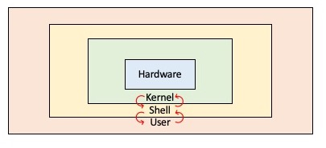

# Shell

---

## 1. 셸이란?

**셸(Shell)** 은 사용자가 운영체제와 상호작용할 수 있도록 도와주는 **명령어 해석기(Command Interpreter)** 이다.

사용자는 셸에 명령어를 입력하고, 셸은 그 명령어를 해석한 뒤 운영체제의 핵심 부분인 **커널(Kernel)** 에 작업을 요청한다.

```text
사용자
  ↓ 명령어 입력
Shell
  ↓ 명령어 해석 및 요청
Kernel
  ↓ 하드웨어 제어
Hardware
```



즉, 셸은 사용자와 운영체제 사이에서 **중간 인터페이스 역할**을 한다.

예를 들어 사용자가 다음 명령어를 입력한다고 하자.

```bash
ls
```

셸은 `ls`라는 명령어를 해석한 뒤, 현재 디렉터리의 파일 목록을 조회하도록 운영체제에 요청한다.

```text
사용자: ls 입력
        ↓
셸: ls 명령어 해석
        ↓
커널: 파일 시스템 정보 조회
        ↓
셸: 결과 출력
```

---

## 2. 셸을 사용하는 이유

운영체제의 커널은 CPU, 메모리, 파일 시스템, 입출력장치와 같은 시스템 자원을 직접 관리한다.

하지만 사용자가 커널에 직접 명령을 내리는 것은 어렵고 위험하다.  
따라서 사용자는 셸을 통해 운영체제의 기능을 간접적으로 사용한다.

셸을 사용하는 이유는 다음과 같다.

| 이유 | 설명 |
|------|------|
| 명령어 실행 | 사용자가 입력한 명령어를 해석하고 실행한다. |
| 운영체제 기능 사용 | 파일 관리, 프로세스 실행, 네트워크 요청 등을 수행할 수 있다. |
| 작업 자동화 | 여러 명령어를 스크립트로 작성해 반복 작업을 자동화할 수 있다. |
| 개발 및 서버 관리 | Git, Docker, 빌드 도구, 서버 접속, 로그 확인 등에 사용된다. |
| 커널과 사용자 사이의 중재 | 사용자가 커널 기능을 안전하게 사용할 수 있도록 돕는다. |

즉, 셸은 운영체제를 효율적으로 사용하기 위한 기본 도구이다.

---

## 3. 셸의 역할과 특징

셸의 핵심 역할은 사용자의 명령을 해석하고 실행하는 것이다.  
단순히 명령어를 입력받는 것뿐만 아니라, 프로그램 실행, 작업 제어, 스크립트 실행 등의 기능도 제공한다.

| 역할 | 설명 |
|------|------|
| 명령어 해석 | 사용자가 입력한 명령어를 분석하고 실행한다. |
| 프로그램 실행 | 명령어에 해당하는 프로그램을 실행한다. |
| 작업 제어 | 실행 중인 작업을 포그라운드 또는 백그라운드에서 관리한다. |
| 스크립트 실행 | 여러 명령어를 파일로 작성하여 자동으로 실행할 수 있다. |
| 사용자 인터페이스 제공 | 사용자가 운영체제와 상호작용할 수 있는 환경을 제공한다. |

셸의 특징은 다음과 같다.

| 특징 | 설명 |
|------|------|
| 텍스트 기반 사용 가능 | 명령어를 직접 입력하여 빠르게 작업할 수 있다. |
| 자동화에 유리 | 반복되는 작업을 스크립트로 작성할 수 있다. |
| 개발 환경에서 중요 | 서버 관리, 배포, 빌드, Docker 실행 등에 자주 사용된다. |
| 운영체제마다 종류가 다름 | Linux, macOS, Windows에서 사용하는 셸이 다를 수 있다. |

---

## 4. 셸, 커널, 터미널의 차이

셸을 이해할 때 자주 혼동되는 개념이 **커널**과 **터미널**이다.

### 셸과 커널

**커널(Kernel)** 은 운영체제의 핵심으로, 하드웨어와 시스템 자원을 직접 관리한다.

반면 **셸(Shell)** 은 사용자의 명령어를 해석하여 커널에 전달하는 역할을 한다.

| 구분 | 셸 | 커널 |
|------|----|------|
| 역할 | 사용자 명령어 해석 | 시스템 자원 관리 |
| 위치 | 사용자와 커널 사이 | 운영체제의 핵심 |
| 주요 기능 | 명령어 실행, 스크립트 실행, 작업 제어 | CPU, 메모리, 파일 시스템, 장치 관리 |
| 예시 | Bash, Zsh, PowerShell | Linux Kernel, Windows NT Kernel |

간단히 정리하면 다음과 같다.

```text
Shell: 사용자의 명령을 받아들이는 인터페이스
Kernel: 실제 시스템 자원을 관리하는 운영체제의 핵심
```

---

### 셸과 터미널

**터미널(Terminal)** 은 사용자가 명령어를 입력하고 결과를 볼 수 있는 프로그램 또는 창이다.

**셸(Shell)** 은 터미널 안에서 실행되어 명령어를 해석하는 프로그램이다.

```text
Terminal
  └── Shell
        └── Command
```

예를 들어 Windows Terminal, macOS Terminal, GNOME Terminal은 터미널 프로그램이다.  
그 안에서 Bash, Zsh, PowerShell 같은 셸이 실행된다.

| 구분 | 설명 | 예시 |
|------|------|------|
| 터미널 | 명령어를 입력하고 결과를 보는 창 | Windows Terminal, macOS Terminal, GNOME Terminal |
| 셸 | 명령어를 해석하고 실행하는 프로그램 | Bash, Zsh, PowerShell |

즉, 터미널은 **명령어를 입력하는 창**이고, 셸은 **명령어를 해석하는 프로그램**이다.

---

## 5. 셸의 종류

셸은 크게 **CLI 셸**과 **GUI 셸**로 나눌 수 있다.

**CLI(Command Line Interface) 셸**은 사용자가 명령어를 문자로 입력하는 방식의 셸이다.  
개발, 서버 관리, 배포 자동화에서 많이 사용된다.

```bash
cd project
ls
mkdir test
```

**GUI(Graphical User Interface) 셸**은 사용자가 그래픽 화면을 통해 운영체제와 상호작용하는 방식이다.  
파일 탐색기, Finder처럼 마우스 클릭과 아이콘을 통해 파일과 프로그램을 관리한다.

| 구분 | CLI 셸 | GUI 셸 |
|------|--------|--------|
| 입력 방식 | 명령어 입력 | 마우스, 아이콘, 메뉴 |
| 장점 | 자동화에 유리하고 빠른 작업 가능 | 직관적이고 사용하기 쉬움 |
| 단점 | 명령어 학습 필요 | 반복 작업 자동화가 상대적으로 어려움 |
| 예시 | Bash, Zsh, PowerShell | Windows Explorer, macOS Finder |

대표적인 CLI 셸은 다음과 같다.

| 셸 | 설명 | 주 사용 환경 |
|----|------|-------------|
| `sh` | Unix 계열의 전통적인 기본 셸 | Unix, Linux |
| `bash` | `sh`를 확장한 대표적인 Linux 셸 | Linux, macOS, Git Bash |
| `zsh` | 자동완성, 테마, 플러그인 기능이 강력한 셸 | macOS, Linux |
| `fish` | 사용 편의성과 자동완성 기능이 뛰어난 셸 | Linux, macOS |
| `PowerShell` | 객체 기반 명령 처리가 가능한 Microsoft 셸 | Windows, Linux, macOS |
| `cmd` | Windows의 전통적인 명령 프롬프트 | Windows |

### 대표 셸 간단 정리

| 셸 | 특징 |
|----|------|
| `sh` | 전통적인 Unix 계열 셸이며 호환성이 높다. |
| `bash` | Linux에서 가장 널리 사용되는 셸 중 하나이다. |
| `zsh` | 자동완성, 테마, 플러그인 기능이 강력하다. |
| `fish` | 사용자 친화적인 자동완성과 문법 강조 기능을 제공한다. |
| `PowerShell` | 문자열이 아닌 객체 기반으로 명령어 결과를 처리할 수 있다. |
| `cmd` | Windows의 전통적인 명령어 인터페이스이다. |

---

## 6. 기본 명령어 예시

Unix/Linux 계열 셸에서 자주 사용하는 기본 명령어는 다음과 같다.

| 명령어 | 설명 |
|--------|------|
| `pwd` | 현재 디렉터리 출력 |
| `ls` | 파일 목록 출력 |
| `cd` | 디렉터리 이동 |
| `mkdir` | 디렉터리 생성 |
| `rm` | 파일 또는 디렉터리 삭제 |
| `cp` | 파일 복사 |
| `mv` | 파일 이동 또는 이름 변경 |
| `cat` | 파일 내용 출력 |
| `echo` | 문자열 출력 |
| `grep` | 특정 문자열 검색 |
| `find` | 파일 검색 |
| `chmod` | 파일 권한 변경 |
| `ps` | 실행 중인 프로세스 확인 |
| `kill` | 프로세스 종료 |
| `curl` | HTTP 요청 전송 |
| `ssh` | 원격 서버 접속 |

백엔드 개발에서는 셸 명령어를 다음과 같은 상황에서 자주 사용한다.

| 상황 | 예시 |
|------|------|
| Git 작업 | 코드 가져오기, 커밋, 브랜치 확인 |
| Java 빌드 | Gradle, Maven 명령어 실행 |
| Spring Boot 실행 | JAR 파일 실행 |
| Docker 사용 | 컨테이너 실행, 로그 확인 |
| 서버 접속 | SSH로 원격 서버 접속 |
| 로그 확인 | 서버 로그 파일 조회 |
| API 테스트 | `curl`을 이용한 HTTP 요청 |

---

## 7. 작업 제어

셸은 실행 중인 작업을 **포그라운드 작업**과 **백그라운드 작업**으로 관리할 수 있다.

| 구분 | 설명 |
|------|------|
| 포그라운드 작업 | 현재 터미널을 점유하고 실행되는 작업 |
| 백그라운드 작업 | 터미널을 점유하지 않고 뒤에서 실행되는 작업 |

### 포그라운드 작업

포그라운드 작업은 터미널에서 직접 실행되고, 해당 작업이 끝나기 전까지 사용자가 같은 터미널에서 다른 명령어를 입력하기 어렵다.

예를 들어 어떤 서버 프로그램을 포그라운드에서 실행하면, 그 프로그램이 종료될 때까지 터미널은 해당 작업에 묶여 있다.

```text
터미널
  ↓
현재 실행 중인 작업이 터미널을 점유
```

### 백그라운드 작업

백그라운드 작업은 터미널을 점유하지 않고 뒤에서 실행되는 작업이다.

백그라운드에서 작업을 실행하면 사용자는 같은 터미널에서 다른 명령어를 계속 입력할 수 있다.

```text
터미널
  ├── 백그라운드 작업 실행 중
  └── 사용자는 다른 명령어 입력 가능
```

예를 들어 서버를 실행해 둔 상태에서 같은 터미널로 다른 명령어를 수행해야 할 때 백그라운드 작업 개념이 사용된다.

---

## 8. 셸 스크립트

**셸 스크립트(Shell Script)** 는 여러 셸 명령어를 하나의 파일에 작성하여 자동으로 실행할 수 있게 만든 파일이다.

반복 작업을 자동화할 때 사용한다.

예를 들어 다음 작업들을 매번 직접 입력한다고 하자.

```bash
git pull
./gradlew build
java -jar build/libs/app.jar
```

이러한 명령어들을 하나의 스크립트 파일에 작성하면 한 번에 실행할 수 있다.

예시 파일명:

```text
run.sh
```

예시 내용:

```bash
echo "프로젝트 최신 코드 가져오기"
git pull

echo "프로젝트 빌드"
./gradlew build

echo "애플리케이션 실행"
java -jar build/libs/app.jar
```

셸 스크립트는 다음과 같은 상황에서 유용하다.

| 상황 | 설명 |
|------|------|
| 반복 작업 자동화 | 매번 입력해야 하는 명령어를 파일로 관리 |
| 빌드 자동화 | 프로젝트 빌드 과정을 명령어로 정리 |
| 배포 자동화 | 서버 배포 절차를 스크립트로 실행 |
| 서버 관리 | 로그 확인, 프로세스 관리, 파일 정리 등에 활용 |

---

## 9. 정리

- 셸은 사용자의 명령어를 해석하여 운영체제에 전달하는 **명령어 해석기**이다.
- 셸은 사용자와 커널 사이에서 인터페이스 역할을 한다.
- 커널은 CPU, 메모리, 파일 시스템, 장치와 같은 시스템 자원을 직접 관리한다.
- 터미널은 명령어를 입력하고 결과를 보는 창이고, 셸은 그 안에서 실행되는 명령어 해석기이다.
- 셸은 CLI 방식과 GUI 방식으로 나눌 수 있다.
- 대표적인 CLI 셸에는 `sh`, `bash`, `zsh`, `fish`, `PowerShell`, `cmd`가 있다.
- 개발자는 셸을 통해 Git, Java 빌드 도구, Docker, SSH, 로그 확인 등의 작업을 수행한다.
- 작업 제어에서는 현재 터미널을 점유하는 포그라운드 작업과 뒤에서 실행되는 백그라운드 작업을 구분한다.
- 셸 스크립트는 여러 명령어를 파일로 작성하여 반복 작업을 자동화하는 데 사용된다.

---

## 10. 핵심 키워드

- Shell
- Command Interpreter
- Kernel
- Terminal
- CLI
- GUI
- sh
- bash
- zsh
- fish
- PowerShell
- cmd
- Foreground
- Background
- Shell Script
- Git
- Gradle
- Maven
- Docker
- SSH
- Server Management
